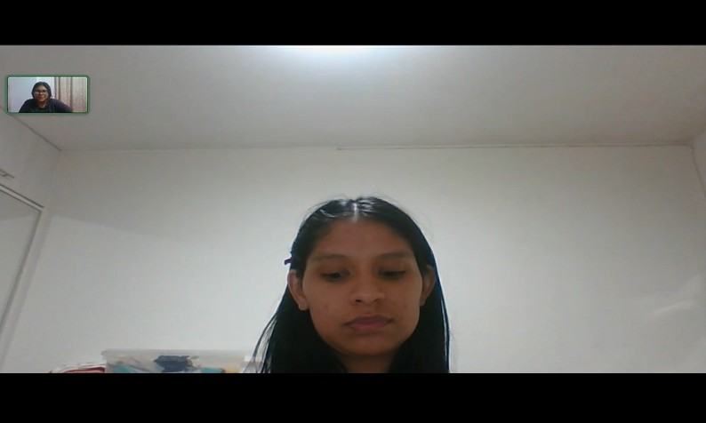
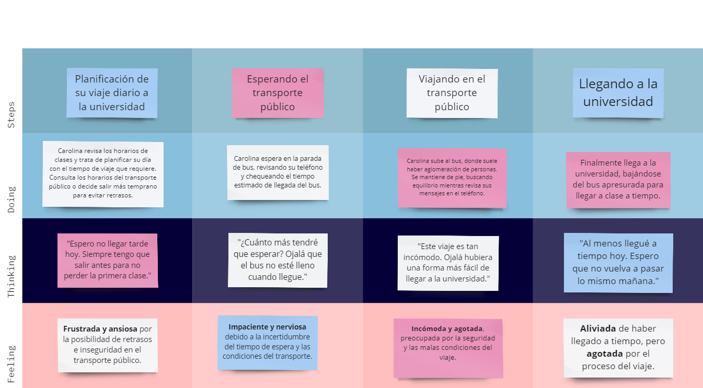

# Universidad Peruana De Ciencias Aplicadas
## 1ACC0238 - Aplicaciones para Dispositivos Móviles

  
  

Universidad Peruana de Ciencias Aplicadas  
  
Carrera: Ingeniería de Software  
  
Ciclo: 2025-01  
  
Curso: Aplicaciones para Dispositivos Móviles  
  
Sección: 346  
  
Profesor: Mayta Guillermo Jorge Luis  
  
Informe del Trabajo Final  
  
Startup: UniLink  
  
Producto: RideUp  

| Member                                | Code       |
|---------------------------------------|------------|
| Belleza Tello, Paolo Eduardo        | u20191A137 |
| Fernandez Alva, Maria Fernanda          | u20201C131 |
| Pilares Pocohuanca, Maria          | u202215528 |
| Ramirez Ortega, Diego Miguel          | u202123548 |
| Valera Garcés, Samuel Ignacio          | u202111952 |

# **Informe de Trabajo Final**
## **Startup: UniLink**
## **Producto: RideUp**
  

     <table align="center">
        <tr>
            <th style="text-align:center;">Código</th>
            <th style="text-align:center;">Apellidos y Nombres</th>
        </tr>
        <tr>
            <td>u202215528</td>
            <td>Pilares Pocohuanca, Maria</td>
        </tr>
        <tr>
            <td>u202123548</td>
            <td>Ramirez Ortega, Diego Miguel</td>
        </tr>
        <tr>
            <td>U20191a137</td>
            <td>Belleza Tello, Paolo Eduardo</td>
        </tr>
        <tr>
            <td>U20201c131</td>
            <td>Fernandez Alva, María Fernanda</td>
        </tr>
        <tr>
            <td>U202111952</td>
            <td>Valera Garces, Samuel Ignacio</td>
        </tr>
    </table>

  

**Abril del 2025**

  
---  
# Registro de Versiones del Informe  
  

<table border="1">
  <thead>
    <tr>
      <th>Versión</th>
      <th>Fecha</th>
      <th>Autor</th>
      <th>Descripción de modificación</th>
    </tr>
  </thead>
  <tbody>
    <tr>
      <td>TB1</td>
      <td>25/04/2025</td>
      <td>
        <ul>
            <li>Pilares Pocohuanca, Maria</li>
            <li>Ramirez Ortega, Diego Miguel</li>
            <li>Valera Garces, Samuel Ignacio</li>
            <li>Belleza Tello, Paolo Eduardo</li>
            <li>Fernandez Alva, Maria Fernanda</li>
        </ul>
      </td>
      <td>
        ● Capítulo I: Introducción 
        ● Capítulo II: Requirements Elicitation & Analysis 
        ● Capítulo III: Requirements Specification 
        ● Capítulo IV: Solution Software Design 
        ● Avance de Conclusiones, Bibliografía y Anexos
      </td>
    </tr>
  </tbody>
</table>

---  
# Project Report Collaboration Insights  
  
A continuación, se detalla el proceso de elaboración del informe para cada entrega, junto con capturas de pantalla que muestran los análisis de colaboración y commits en GitHub para el repositorio del informe:

**URL del Repositorio del Informe:** [https://github.com/UniLink-Grupo3/Report](https://github.com/UniLink-Grupo3/Report)  

**Entrega N°1: TB1**
 
- Todos los miembros del equipo contribuyeron en la redacción del Informe. Se dividió en secciones específicas para cada capítulo, lo que permitió un mayor avance y equidad en el desarrollo del informe.

- Se establecieron fechas límite para la finalización de cada capítulo, lo que facilitó el avance de cada capítulo.
  
---  
# Student Outcome  

<table>
  <tr>
    <th>Criterio Específicos</th>
    <th>Acciones realizadas</th>
    <th>Conclusiones</th>
  </tr>
  <tr>
    <td rowspan="5"><strong>Actualiza conceptos y conocimientos necesarios para su desarrollo profesional y en especial para su proyecto en soluciones de software</strong></td>
    <td><strong>Fernandez Alva, Maria Fernanda</strong> 
    <strong>TB1:</strong>Durante el desarrollo del proyecto, reforcé conocimientos sobre Bounded Contexts y su importancia en la estructuración del sistema. Usé herramientas como Vertabelo y Structurizr para modelar los datos y la arquitectura. </td>
    <td rowspan="5">
    <strong>TB1:</strong>Como equipo, actualizamos y fortalecimos nuestros conocimientos usando herramientas como Uxpressia para user persona y journey mapping, Structurizr para el modelo C4, y análisis de la competencia. Estas herramientas nos ayudaron a diseñar una solución de software más completa y centrada en el usuario. 
    </td>
  </tr>
  <tr>
    <td><strong>Belleza Tello, Paolo Eduardp</strong> 
    <strong>TB1:</strong> Realicé uno de los principales Bounded Contexts del proyecto para entender el funcionamiento de una parte clave de la app. Utilicé StarUML para diagramas de clases y contenedores, y Structurizr para modelar en los niveles 2, 3 y 4 del modelo C4. Esto fortaleció mis conocimientos en modelado de software y estructura de sistemas complejos.</td>
  </tr>
  <tr>
    <td><strong>Valera Garces, Samuel Ignacio</strong> 
    <strong>TB1:</strong> Realicé un proceso de EventStorming para comprender en profundidad una parte clave de la aplicación. Utilicé Miro para modelar Domain Message Flows, Bounded Context Canvases y realizar Candidate Context Discovery. Esta actividad me permitió identificar uno de los principales Bounded Contexts del proyecto, lo que fortaleció significativamente mis conocimientos en modelado de dominios y diseño de sistemas complejos.</td>
  </tr>
  <tr>
    <td><strong>Ramirez Ortega, Diego Miguel</strong> 
    <strong>TB1:</strong> Realicé la el Context mapping para entender las relaciones entre los bounded context. Luego, he realizado los diagramas de contexto y contenedor pertenecientes al modelo C4. Por último, he realizado el diagrama de despliegue del sistema. Esto me permitio aprender sobre y actualizar mi conocimiento sobre la arquitectura en general de un sistema y la relación entre sus componentes</td>
  </tr>
  <tr>
    <td><strong>Alumno 5</strong> 
    <strong>TB1:</strong> Realicé .......</td>
  </tr>
  <tr>
    <td rowspan="5"><strong>Reconoce la necesidad del aprendizaje permanente para el desempeño profesional y el desarrollo de proyectos en soluciones de software.</strong></td>
    <td><strong>Fernandez Alva, Maria Fernanda</strong> 
    <strong>TB1:</strong> Para retomar el uso de estas herramientas, recurrí a videos de YouTube y documentación oficial. Apliqué estrategias de autoaprendizaje, como el estudio del modelo C4, para elaborar diagramas del sistema. </td>
    <td rowspan="5">
    <strong>TB1:</strong> El uso de nuevas metodologías y entrevistas a usuarios nos impulsó a investigar y aprender de forma continua. Este proceso nos permitió identificar necesidades reales y aplicar estrategias de aprendizaje colaborativo, reconociendo así el valor del aprendizaje permanente en nuestra formación profesional.</td>
  </tr>
  <tr>
    <td><strong>Belleza Tello, Paolo Eduardo</strong> 
    <strong>TB1:</strong> Para aplicar correctamente estas herramientas, consulté la documentación oficial del modelo C4 y videos de YouTube sobre el uso de StarUML. Este proceso me ayudó a comprender la necesidad del aprendizaje continuo. Gracias a ello, pude implementar estrategias de autoformación efectivas para mejorar mi desempeño.</td>
  </tr>
  <tr>
    <td><strong>Valera Garces, Samuel Ignacio</strong> 
    <strong>TB1:</strong> Para aplicar correctamente estas herramientas, me apoyé en documentación oficial sobre EventStorming y en recursos como artículos especializados y videos de YouTube sobre el uso de Miro en entornos colaborativos. Este proceso reforzó en mí la importancia del aprendizaje continuo y me permitió desarrollar estrategias de autoformación efectivas para mejorar mi desempeño y comprensión del modelado de dominios.</td>
  </tr>
  <tr>
    <td><strong>Ramirez Ortega, Diego Miguel</strong> 
    <strong>TB1:</strong>  Para desarrollar los diagramas corespondientes consulté documentación para aplicar buenas prácticas y que tenga coherencia. Además, para el diseño de los diagramas, he consultado la documentación de DSL, lenguaje utilizado en Structurz, en donde he realizado los diagramas de contexto y componentes. Esto me ayudó a reforzar mi interés por el aprendizaje continuo sobre los conocimientos adquiridos a lo largo de la carrera</td>
  </tr>
  <tr>
    <td><strong>Alumno 5</strong> 
    <strong>TB1:</strong> Realicé .......</td>
  </tr>
</table>

---
# Objetivos SMART
  
<table border="1">
  <tr>
    <th>Belleza Tello, Paolo Eduardo</th>
  </tr>
  <tr>
    <td>
      <strong>Objetivo SMART 1:</strong> 
      Aprender los fundamentos del lenguaje de programación utilizado en Android Studio (Kotlin o Java), completando al menos 3 módulos teóricos y 3 ejercicios prácticos por semana hasta la semana 10, para poder programar funcionalidades básicas sin ayuda externa.
        
      <strong>Objetivo SMART 2:</strong> 
      Aprender a implementar la navegación entre pantallas usando el Navigation Component de Android Studio, creando una app con al menos 2 pantallas conectadas entre sí antes de la semana 8, incluyendo la navegación con paso de datos entre pantallas.
    </td>
  </tr>
  
  <tr>
    <th>Fernandez Alva, Maria Fernanda</th>
  </tr>
  <tr>
    <td>
      <strong>Objetivo SMART 1:</strong> 
      Dominar la sintaxis básica del lenguaje Kotlin completando un curso introductorio en línea de al menos 10 módulos antes de la semana 6, dedicando mínimo 4 horas por semana.
        
      <strong>Objetivo SMART 2:</strong> 
      Organizar y utilizar correctamente los resources en Android Studio (colores, strings, dimensiones, drawables) creando una interfaz con diseño adaptable en al una pantalla antes de la semana 9, sin usar valores escritos directamente en el código (hardcoded)
    </td>
  </tr>

  <tr>
    <th>Valera Garces, Samuel Ignacio</th>
  </tr>
  <tr>
    <td>
      <strong>Objetivo SMART 1:</strong> 
      Aprender y aplicar los fundamentos de EventStorming, completando al menos 3 sesiones de práctica (Domain Message Flow, Bounded Context Canvas y Candidate Context Discovery) en Miro antes de la semana 6, para poder identificar Bounded Contexts relevantes sin asistencia externa.
        
      <strong>Objetivo SMART 2:</strong> 
      Desarrollar habilidades en modelado colaborativo de dominios utilizando Miro, facilitando al menos una sesión de EventStorming grupal simulada antes de la semana 8, incluyendo la documentación y síntesis de los hallazgos para su uso en diseño de arquitectura.
    </td>
  </tr>

  <tr>
    <th>Pilares Pocohuanca, Maria</th>
  </tr>
  <tr>
    <td>
      <strong>Objetivo SMART 1:</strong> 
      Comprender los fundamentos del diseño de interfaces móviles en Android Studio, desarrollando al menos 3 prototipos de pantalla funcionales (login, home y perfil), aplicando buenas prácticas de usabilidad y diseño adaptable.
       
      <strong>Objetivo SMART 2:</strong> 
      Aprender a integrar funcionalidades básicas con componentes móviles (como botones, listas y campos de texto), construyendo una vista interactiva que responda a acciones del usuario sin depender de asistencia externa para su implementación.
    </td>
  </tr>

  
  <tr>
    <th>Ramirez Ortega, Diego Miguel</th>
  </tr>
  <tr>
    <td>
      <strong>Objetivo SMART 1:</strong> Adquirir conocimientos sólidos en arquitecturas de software (como monolítica, microservicios y serverless) mediante lo aprendido en los cursos universitarios y además en cursos certificados (ej: Coursera) y aplicarlos en un proyecto personal, desarrollando un sistema escalable en 6 meses. 
       
      <strong>Objetivo SMART 2:</strong>Mejorar mis habilidades en backend (con .NET) implementando APIs RESTful con autenticación JWT y conexión a bases de datos SQL/NoSQL, para completar un proyecto de e-commerce funcional en 5 meses. 
    </td>
  </tr>
</table>

---  
# Contenido  
## Tabla de contenidos  
  
### Capítulo I: Presentación
- [1.1. Startup Profile](#11-startup-profile)  
  - [1.1.1 Descripción de la Startup](#111-descripción-de-la-startup)  
  - [1.1.2 Perfiles de integrantes del equipo](#112-perfiles-de-integrantes-del-equipo)  
- [1.2 Solution Profile](#12-solution-profile)  
  - [1.2.1 Antecedentes y problemática](#121-antecedentes-y-problemática)  
  - [1.2.2 Lean UX Process](#122-lean-ux-process)  
      - [1.2.2.1. Lean UX Problem Statements](#1221-lean-ux-problem-statements)  
      - [1.2.2.2. Lean UX Assumptions](#1222-lean-ux-assumptions)  
      - [1.2.2.3. Lean UX Hypothesis Statements](#1223-lean-ux-hypothesis-statements)  
      - [1.2.2.4. Lean UX Canvas](#1224-lean-ux-canvas)  
- [1.3. Segmentos objetivo](#13-segmentos-objetivo)  

  
### Capítulo II: Requirements Elicitation & Analysis 
- [2.1. Competidores](#21-competidores)  
  - [2.1.1. Análisis competitivo](#211-análisis-competitivo)  
  - [2.1.2. Estrategias y tácticas frente a competidores](#212-estrategias-y-táticas-frente-a-competidores)  
- [2.2. Entrevistas](#22-entrevistas)  
  - [2.2.1. Diseño de entrevistas](#221-diseño-de-entrevistas)  
  - [2.2.2. Registro de entrevistas](#222-registro-de-entrevistas)  
  - [2.2.3. Análisis de entrevistas](#223-análisis-de-entrevistas)  
- [2.3. Needfinding](#23-needfinding)  
  - [2.3.1. User Personas](#231-user-personas)  
  - [2.3.2. User Task Matrix](#232-user-task-matrix)  
  - [2.3.3. User Journey Mapping](#233-user-journey-mapping)  
  - [2.3.4. Empathy Mapping](#234-empathy-mapping)  
  - [2.3.5. As-is Scenario Mapping](#235-as-is-scenario-mapping)  
- [2.4. Ubiquitous Language](#24-ubiquitous-language)

  
### Capítulo III: Requirements Specification 
- [3.1. To-Be Scenario Mapping](#31-to-be-scenario-mapping)  
- [3.2. User Stories](#32-user-stories)  
- [3.3. Impact Mapping](#33-impact-mapping)  
- [3.4. Product Backlog](#34-product-backlog)  
  
  

### Capítulo IV: Product Design 
- [4.1. Strategic-Level Domain-Driven Design](#41-strategic-level-domain-driven-design)
  - [4.1.1. EventStorming](#411-eventstorming)
      - [4.1.1.1. Candidate Context Discovery](#4111-candidate-context-discovery)
      - [4.1.1.2. Domain Message Flows Modeling](#4112-domain-message-flows-modeling)
      - [4.1.1.3. Bounded Context Canvases](#4113-bounded-context-canvases)
  - [4.1.2. Context Mapping](#412-context-mapping)
  - [4.1.3. Software Architecture](#413-software-architecture)
      - [4.1.3.1. Software Architecture Context Level Diagrams](#4131-software-architecture-context-level-diagrams)
      - [4.1.3.2. Software Architecture Container Level Diagrams](#4132-software-architecture-container-level-diagrams)
      - [4.1.3.3. Software Architecture Deployment Diagrams](#4133-software-architecture-deployment-diagrams)
- [4.2. Tactical-Level Domain-Driven Design](#42-tactical-level-domain-driven-design)
  - [4.2.1. Bounded Context: Carpooling](#421-bounded-context-carpooling)
      - [4.2.1.1. Domain Layer](#4211-domain-layer)
      - [4.2.1.2. Interface Layer](#4212-interface-layer)
      - [4.2.1.3. Application Layer](#4213-application-layer)
      - [4.2.1.4. Infrastructure Layer](#4214-infrastructure-layer)
      - [4.2.1.5. Bounded Context Software Architecture Component Level Diagrams](#4215-bounded-context-software-architecture-component-level-diagrams)
      - [4.2.1.6. Bounded Context Software Architecture Code Level Diagrams](#4216-bounded-context-software-architecture-code-level-diagrams)
          - [4.2.1.6.1. Bounded Context Domain Layer Class Level Diagrams](#42161-bounded-context-domain-layer-code-level-diagrams)
          - [4.2.1.6.2. Bounded Context Database Design Diagram](#42161-bounded-context-domain-layer-class-diagrams)
  - [4.2.2. Bounded Context: Authentication](#422-bounded-context-authentication)
      - [4.2.2.1. Domain Layer](#4211-domain-layer)
      - [4.2.2.2. Interface Layer](#4212-interface-layer)
      - [4.2.2.3. Application Layer](#4213-application-layer)
      - [4.2.2.4. Infrastructure Layer](#4214-infrastructure-layer)
      - [4.2.2.5. Bounded Context Software Architecture Component Level Diagrams](#4215-bounded-context-software-architecture-component-level-diagrams)
      - [4.2.2.6. Bounded Context Software Architecture Code Level Diagrams](#4216-bounded-context-software-architecture-code-level-diagrams)
          - [4.2.2.6.1. Bounded Context Domain Layer Class Level Diagrams](#42161-bounded-context-domain-layer-code-level-diagrams)
          - [4.2.2.6.2. Bounded Context Database Design Diagram](#42161-bounded-context-domain-layer-class-diagrams)

- [Avance de Conclusiones](#avance-de-conclusiones)
- [Bibliografía](#bibliografía)
- [Anexos](#anexos)

  /*
### Capítulo V: Solution UI/UX Design 
- [5.1. Product design](#51-product-design)  
  - [5.1.1. Style Guidelines](#511-style-guidelines) 
    - [5.1.1.1. General Style Guidelines](#5111-general-style-guidelines)
  - [5.1.2. Information Architecture](#512-information-architecture)
    - [5.1.2.1. Organization Systems](#5121-organization-systems)  
    - [5.1.2.2. Labelling Systems](#5122-labelling-systems)
    - [5.1.2.3. SEO Tags and Meta Tags](#5123-seo-tags-and-meta-tags)
    - [5.1.2.4. Searching Systems](#5124-searching-systems)
    - [5.1.2.5. Navigation Systems](#5125-navigation-systems)
  - [5.1.3. Landing Page UI Design](#513-landing-page-ui-design)
    - [5.1.3.1. Landing Page Wireframe](#5131-landing-page-wireframe)  
    - [5.1.3.2. Landing Page Mock-up](#5132-landing-page-mock-up) 
  - [5.1.4. Mobile Applications UX/UI Design](#514-mobile-applications-ux/ui-design)  
    - [5.1.4.1. Mobile Applications Wireframes](#5141-mobile-applications-wireframes)  
    - [5.1.4.2. Mobile Applications Wireflow Diagrams](#5142-mobile-applications-wireflow-diagrams) 
    - [5.1.4.3. Mobile Applications Mock-ups](#5143-mobile-applications-mock-ups)  
    - [5.1.4.4. Mobile Applications User Flow Diagrams](#5144-mobile-applications-user-flow-diagrams)
    - [5.1.4.5. Mobile Applications Prototyping](#5145-mobile-applications-prototyping)  

### Capítulo VI: Product Implementation, Validation & Deployment 
- [6.1. Software Configuration Management](#61-software-configuration-management)  
  - [6.1.1. Software Development Environment Configuration](#611-software-development-environment-configuration) 
  - [6.1.2. Source Code Management](#612-source-code-management)
  - [6.1.3. Source Code Style Guide & Conventions](#613-source-code-style-guide-&-conventions) 
  - [6.1.4. Software Deployment Configuration](#614-software-deployment-configuration) 
- [6.2. Landing Page & Mobile Application Implementation](#62-landing-page-&-mobile-application-implementation)  
  - [6.2.X Sprint n](#62x-sprint-n)
    - [6.2.X.1. Sprint Planning n](#62x1-sprint-planning-n)
    - [6.2.X.2. Sprint Backlog n](#62x2-sprint-backlog-n)
    - [6.2.X.3. Development Evidence for Sprint Review](#62x3-development-evidence-for-sprint-review)
    - [6.2.X.4. Testing Suite Evidence for Sprint Review](#62x4-testing-suite-evidence-for-sprint-review)
    - [6.2.X.5. Execution Evidence for Sprint Review](#62x5-execution-evidence-for-sprint-review)
    - [6.2.X.6. Services Documentation Evidence for Sprint Review](#62x6-services-documentation-evidence-for-sprint-review)
    - [6.2.X.7. Software Deployment Evidence for Sprint Review](#62x7-software-deployment-evidence-for-sprint-review)
    - [6.2.X.8. Team Collaboration Insights during Sprint](#62x8-team-collaboration-insights-during-sprint)
- [6.3. Validation Interviews](#63-validation-interviews)  
  - [6.3.1. Diseño de Entrevistas](#631-diseño-de-entrevistas) 
  - [6.3.2. Registro de Entrevistas](#632-registro-de-entrevistas)
  - [6.3.3. Evaluaciones según heurísticas](#633-evaluaciones-segun-heuristicas) 
- [6.4. Video About-the-Product](#64-viedo-about-the-product)  

*/
  
---  
# Capítulo I: Introducción  
## 1.1. Startup Profile  

### 1.1.1 Descripción de la Startup  

UniLink es una startup fundada por un grupo de estudiantes de la Facultad de Ingeniería de la Universidad Peruana de Ciencias Aplicadas (UPC) con el objetivo de abordar las preocupaciones y desafíos que enfrentan los estudiantes universitarios al movilizarse. Ante las dificultades para acceder a un transporte cómodo y asequible, estamos desarrollando una plataforma innovadora que permite compartir viajes en vehículos particulares entre compañeros de universidad. Con RideUp, buscamos no solo ofrecer una alternativa económica y social al transporte público, sino también reducir la congestión vehicular y promover un uso más eficiente de los recursos. Nuestro equipo, apasionado por la tecnología y la sostenibilidad, está comprometido en brindar una solución de movilidad segura, conveniente y colaborativa para la comunidad estudiantil.

**Misión:** . 
Nuestra misión es facilitar el transporte universitario a través de una plataforma accesible y colaborativa que permita a los estudiantes compartir viajes de manera segura y económica, mejorando su experiencia de movilidad diaria.

**Objetivo:** 
Aspiramos a ser líderes en movilidad estudiantil, reconocidos por nuestro compromiso con la sostenibilidad, la eficiencia y la satisfacción de nuestros usuarios, proporcionando una experiencia de transporte innovadora y socialmente responsable para estudiantes del Perú.

### 1.1.2 Perfiles de integrantes del equipo  

<table>
  <tr>
    <th>Miembros del equipo</th>
    <th>Descripción</th>
  </tr>
  <tr>
    <td></td>
    <td>Mi nombre es Paolo Eduardo Belleza Tello. Soy una persona comprometida con alcanzar mis metas, decidido a ejercer la carrera de Ingeniería de Software. Me gustaría especializarme en Front-End, ya que es el área en la que me siento más cómodo y enfocado. Además, disfruto aprendiendo nuevas tecnologías cada día, ya que el aprendizaje continuo me apasiona y me motiva. Mis principales fortalezas son la persistencia, el trabajo en equipo y la organización.</td>
  </tr>
  
   <tr>
    <td></td>
    <td>Mi nombre ess Maria Fernanda Fernandez Alva. Soy una persona muy responsable y siempre me esfuerzo por estar atenta al grupo para apoyar en caso de que alguno de nosotros enfrente dificultades con sus tareas. Tengo conocimientos básicos en HTML, CSS y JavaScript, lo que me permite comprender y desarrollar proyectos web. Mi meta es emprender en el campo de la programación de páginas web, donde espero aplicar mis habilidades y crecer profesionalmente.</td>
  </tr>

  <tr>
    <td></td>
    <td>Mi nombre es Maria Pilares Pocohuanca, tengo 22 años y estudio la carrera de ingeniería de software en la UPC. Desde niña tuve mucho interés por las matemáticas y la tecnología, motivo por el cual estudio una ingeniería enfocada más a la programación. Me considero una persona perseverante aunque algo impaciente. Sin embargo, como miembro del equipo me comprometo a colaborar con mis compañeros y realizar todas las indicaciones que se dicten, todo con el fin de presentar un buen proyecto.</td>
  </tr>

  <tr>
    <td></td>
    <td>Mi nombre es Diego Ramirez, tengo 21 años y estoy estudiando la carrera de Ingeniería de Software. Tengo conocimiento en C++, Python y edición de vídeo. Estoy comprometido a completar las tareas que se me asignen a tiempo y apoyar en lo que pueda en el proyecto.</td>
  </tr>

  <tr>
    <td></td>
    <td>	Hola, mi nombre es Samuel, estudiante de la carrera de Ingeniería de software. Me considero una persona responsable, empática y con adaptación rápida al trabajo en equipo. Cuento con conocimiento en diversos lenguajes de programacion. Mi objetivo a futuro es utilizar la tecnología para el desarrollo de aplicaciones que necesite la sociedad en el día a día. En mis tiempos libres, me gusta practicar guitarra y leer.            
</td>
  </tr>

</table>

---
 
## 1.2 Solution Profile  

### 1.2.1 Antecedentes y problemática  

### Antecedentes:
La movilidad estudiantil en zonas urbanas ha sido un reto constante para los estudiantes universitarios, especialmente en grandes ciudades como Lima, donde la congestión vehicular y la falta de opciones de transporte eficientes afectan directamente la calidad de vida. El transporte público convencional a menudo resulta incómodo, inseguro, y poco fiable, mientras que tener un vehículo propio no es una opción accesible para muchos estudiantes debido a los altos costos de adquisición y mantenimiento.
 
El auge de la tecnología y las aplicaciones móviles ha abierto nuevas posibilidades para abordar este problema mediante soluciones innovadoras como el carpooling, que no solo promueven un uso más eficiente de los recursos, sino que también ofrecen una alternativa más económica y socialmente integrada al transporte tradicional.
 
RideUp surge en este contexto con la misión de proporcionar una solución que permita a los estudiantes universitarios compartir viajes en vehículos particulares. Con esta plataforma, buscamos no solo aliviar los problemas de transporte, sino también fomentar la sostenibilidad, reducir el tráfico, y mejorar la seguridad en los desplazamientos diarios hacia las universidades.

### Problemática (5Ws y 2Hs)
##### What (Qué)
 
###### ¿Cuál es el problema?

La problemática percibida por nuestra startup radica en la falta de opciones de transporte eficiente, seguro y económico para los estudiantes universitarios. Los estudiantes, en su mayoría, dependen de un transporte público lento, incómodo y en muchos casos inseguro, lo que repercute en su bienestar y rendimiento académico.

##### When (Cuando)

###### ¿Cuándo sucede el problema?

Este problema se presenta diariamente cuando los estudiantes necesitan trasladarse a sus universidades. El transporte público suele tener horarios y rutas poco optimizados, lo que se traduce en largas esperas, trayectos prolongados, y una experiencia de viaje incómoda y, en algunos casos, insegura.

##### Where (Donde)

###### ¿A dónde se dirige?
El servicio está diseñado para ser una herramienta de alto impacto para los estudiantes que buscan un equilibrio económico y confortable en sus desplazamientos hacia la universidad.
 
###### ¿Dónde surge el problema?
El problema se deriva de cuestiones socioculturales, como la inseguridad en Perú durante la espera impredecible de los transportes públicos, que puede resultar tediosa. Asimismo, el costo elevado de utilizar constantemente autos particulares para desplazarse resulta ser una opción poco viable para la economía de los estudiantes que no cuenten con los recursos económicos necesarios.

##### Who (Quién)
###### ¿Quiénes están involucrados? ¿Quién lo utilizará?
Los usuarios del sistema serán principalmente estudiantes universitarios. Por un lado, aquellos que dispongan de un vehículo y busquen generar ganacias durante su recorrido hacia la universidad. Por otro lado, se encuentran los estudiantes que utilizarán este servicio y su rol sera el de pasajero.

##### Why (Por qué)
###### ¿Cuál es la causa del problema?
La causa principal del problema es la ineficiencia del transporte público y la falta de alternativas que sean tanto accesibles económicamente como confiables en términos de seguridad y comodidad. Además, el uso de vehículos privados de manera individual contribuye a la congestión vehicular, afectando la calidad de vida en las ciudades.
 
### ¿Cuáles son las 2H?
 
##### How (Cómo)
###### ¿Cómo se utilizará el producto?
El producto sera empleado mediante una  plataforma web, donde los estudiantes podrán programar sus viajes, conocer los horarios y rutas disponibles, realizar pagos en línea y recibir actualizaciones en tiempo real sobre el estado del servicio. 
 
###### ¿Cómo lograremos desarrollar la correcta gestión del proceso de carpooling entre estudiantes?
Después de que el estudiante inicia sesión en el sistema y elige su universidad de destino, el sistema presenta los conductores disponibles que viajan por la misma ruta. Si el estudiante está conforme con la hora estimada de llegada y la calificación del conductor, puede reservar un viaje y proceder con el pago. Una vez que el conductor complete todos los asientos, debe indicar que no hay más asientos disponibles. Después de llegar a destino, los usuarios tienen la opción de calificar al conductor.
 
##### How much (Cuánto)
###### ¿Cuál es la magnitud del problema?
En Lima, se registran numerosos problemas socioculturales, como la delincuencia y el tráfico, que pueden ser especialmente perjudiciales para los estudiantes que suelen llevar consigo sus teléfonos celulares y computadoras portátiles (INEI, 2021). Estudios previos han demostrado que el crimen en Lima afecta negativamente la calidad de vida de los residentes, exacerbando los niveles de estrés y ansiedad (Traverso, 2020). Además, la situación del tráfico en la ciudad ha sido objeto de preocupación constante, ya que los estudiantes corren el riesgo de llegar tarde a clases o exámenes debido a las frecuentes paradas de los autobuses en cada tramo (Municipalidad Metropolitana de Lima, 2023).
 
###### Quienes seran los beneficiados por el servicio?
Los estudiantes universitarios que deseen una alternativa que sea eficiente, cómoda y económica, así como aquellos que busquen generar ingresos o reducir sus gastos en combustible durante su viaje hacia la universidad.

 

### 1.2.2 Lean UX Process  
#### 1.2.2.1. Lean UX Problem Statements  

Nuestro servicio de carpooling para estudiantes universitarios se diseñó con el fin de mejorar la experiencia de transporte de nuestros usuarios, reducir el estrés, el riesgo de robos, la fatiga por autobuses abarrotados y los costos elevados. Sin embargo, hemos notado que el servicio no está cumpliendo completamente con estos objetivos. Los estudiantes siguen enfrentando problemas de estrés y fatiga, y los costos no se han reducido significativamente. Además, la falta de coincidencia en horarios y rutas entre los usuarios y la baja ocupación de los vehículos están limitando la efectividad del servicio.
 
¿Cómo podemos mejorar nuestro servicio para asegurar que los estudiantes universitarios encuentren compañeros de viaje compatibles, optimicen el uso de los vehículos y reduzcan significativamente los costos y las dificultades asociadas con el transporte diario?
 
### Aspectos
 
#### Domain:
Movilidad y transporte compartido para estudiantes universitarios.
 
#### Customer Segments:
 
- ##### Estudiantes Universitarios
Estudiantes que necesitan desplazarse a sus universidades y buscan una alternativa al transporte público o a los vehículos particulares. Estos estudiantes enfrentan desafíos como el estrés, la inseguridad y el costo elevado del transporte.
 
- ##### Propietarios de Vehículos Privados
Estudiantes que poseen vehículos y desean compartir sus viajes con otros para reducir gastos en combustible y maximizar el uso de sus vehículos.
 
#### Pain Points:
 
- ##### Estudiantes
 
###### Estrés y Fatiga:
La congestión en el transporte público y las largas esperas causan estrés y fatiga, afectando negativamente su experiencia de desplazamiento.
 
###### Inseguridad:
La inseguridad durante el viaje, especialmente en autobuses abarrotados, es una preocupación constante.
 
###### Costo Elevado: 
 
Los gastos en transporte son una carga financiera significativa para los estudiantes.
 
- ##### Propietarios de Vehículos Privados
 
###### Oportunidades de Rellenar Asientos: 
Hay una falta de mecanismos eficientes para asegurar que todos los asientos disponibles en un viaje compartido sean utilizados, reduciendo el potencial de ingresos por compartir el viaje.

#### Gap:
Existe una brecha en el mercado de transporte compartido específico para estudiantes universitarios. Aunque hay aplicaciones de viajes compartidos, no están adaptadas a las necesidades y horarios específicos de los estudiantes, lo que dificulta la formación de compañeros de viaje compatibles y la optimización del uso del vehículo.
 
#### Vision/Strategy:
Crear una plataforma de carpooling diseñada específicamente para estudiantes universitarios que permita una conexión efectiva entre compañeros de viaje con horarios y rutas compatibles. La plataforma debe abordar el estrés y la inseguridad relacionados con el transporte, al mismo tiempo que ofrece una solución económica y eficiente para los estudiantes que desean compartir sus viajes y reducir costos.

#### 1.2.2.2. Lean UX Assumptions  

Assumptions play a crucial role in identifying project risks and fostering team participation and active engagement.

#### User Assumptions

Who is the user?
- The user is any university student interested in a faster, safer, and more efficient way to commute to their university.

Where does our product fit into their work or life?
- Our product integrates seamlessly into users' daily lives, providing an efficient and accessible transportation solution. It helps avoid stress, risks of theft, fatigue caused by overcrowded buses, and high transportation costs.

What problems does our product need to solve?
- Our product addresses inefficiencies in commuting, scheduling conflicts among travel companions, and low vehicle occupancy that limit carpooling effectiveness. It also aims to reduce transportation costs and enhance the overall experience for students.

When and how is our product used?
- The product is used daily by students to coordinate shared rides to and from the university. It matches users with compatible routes and schedules.

How should our product look and behave?
- The product should be intuitive and user-friendly, featuring an interface that enables users to efficiently plan and coordinate trips. It must function reliably, ensuring users can quickly find travel companions and complete their trips safely and affordably.

#### Business Assumptions

We believe that:
- Our customers need a platform that allows them to coordinate and share rides to the university in a safe, efficient, and economical way. Students are seeking to reduce travel costs and times while minimizing stress associated with daily transportation.
- These needs can be addressed with a mobile application that connects university students, enabling them to share car rides, lower transportation expenses, and improve their daily commuting experience.

The #1 value my customer wants from my service:

- For students offering rides: A platform that helps fill empty seats in their vehicles, optimizing costs and maximizing the efficiency of their daily commutes.

- For students seeking rides: A secure and economical way to reach the university, reducing travel time and the stress of overcrowded public transportation.

- For universities: A solution that reduces traffic congestion and environmental impact, promoting a more sustainable mode of transportation for their students.

Additional benefits for customers:

- Student Networking: Opportunities to connect with fellow university students, building a social and academic network that enriches their university experience.

- Incentives and Rewards: Frequent users can access discounts, special promotions, or rewards for participating in the carpooling system.

- Feedback and Continuous Improvement: Users can provide and receive feedback on trips, enhancing service quality and ensuring a positive experience for all involved.

#### 1.2.2.3. Lean UX Hypothesis Statements  

**Creemos que** al simplificar el proceso de registro y la verificación de usuarios en nuestra plataforma, aumentaremos la tasa de conversión de nuevos estudiantes que se inscriben para usar el servicio de carpooling. **Sabremos que** hemos tenido éxito cuando observemos un aumento significativo en el número de cuentas activas en los primeros 7 días después del lanzamiento.

**Creemos que** al ofrecer una sección destacada para los “Viajes Más Populares de la Semana”, aumentaremos la participación de los estudiantes en la plataforma. **Sabremos que** hemos tenido éxito cuando observemos un aumento en las visitas a esta sección y una mayor interacción con los viajes destacados.

**Creemos que** al proporcionar métricas claras sobre la eficiencia de los viajes (como ahorro de tiempo y dinero), motivaremos a más estudiantes a utilizar nuestro servicio de manera regular. **Sabremos que** hemos tenido éxito cuando veamos un aumento en la frecuencia de uso del servicio y una mayor satisfacción de los usuarios.

**Creemos que** al incorporar un sistema de recompensas para conductores y pasajeros frecuentes, aumentaremos la retención de usuarios y generaremos un uso más constante de la plataforma. **Sabremos que** hemos tenido éxito cuando observemos un aumento en la lealtad de los usuarios y una mayor participación activa en la plataforma.

#### 1.2.2.4. Lean UX Canvas  

| **Lean UX Canvas**                                                                                                                                                               | **Fecha:** 20/04/2025                                                                                               | **Iteración:** 1 |
|----------------------------------------------------------------------------------------------------------------------------------------------------------------------------------|--------------------------------------------------------------------------------------------------------------------|------------------|
| **1. Business Problem:**                                                                                                                                                         | **5. Solutions:**                                                                                                  | **2. Business Outcomes:** |
| - La falta de un sistema eficiente y confiable que conecte a los estudiantes universitarios que necesitan compartir transporte hacia la universidad.                              | - **Plataforma de Carpooling:** Sistema que permita a los estudiantes ofrecer y encontrar viajes compartidos hacia la universidad.                        | - Aumento en el número de usuarios activos y viajes compartidos realizados. |
| - Aunque existen alternativas de transporte público y privado, los estudiantes enfrentan problemas como el tráfico, el costo elevado, la inseguridad y la pérdida de tiempo.      | - **Verificación de Usuarios:** Proceso de verificación para garantizar la seguridad y confianza entre los usuarios.                                       | - Reducción de costos de transporte para los estudiantes. |
| - Además, la falta de una solución que optimice el uso de vehículos privados entre estudiantes afecta la movilidad y la sostenibilidad.                                           | - **Sistema de Recompensas:** Incentivos para conductores y pasajeros frecuentes.                                                                         | - Mejora en la eficiencia y sostenibilidad del transporte universitario. |
|                                                                                                                                                                                  | - **Funcionalidad de Chat:** Herramienta de comunicación directa entre conductores y pasajeros para coordinar detalles del viaje.                        | - Reconocimiento y adopción de la plataforma como la opción preferida para el carpooling entre estudiantes universitarios. |
|                                                                                                                                                                                  | - **Integración de Rutas:** Sincronización con aplicaciones de mapas para optimizar las rutas y tiempos de viaje.                                         | |
|                                                                                                                                                                                  | - **Notificaciones en Tiempo Real:** Alertas sobre cambios en la ruta o disponibilidad de viajes.                                                        | |

| **3. Users:**                                                                                                                                                                   | **6. Hypotheses:**                                                                                                                                       | **4. User Outcomes & Benefits:** |
|---------------------------------------------------------------------------------------------------------------------------------------------------------------------------------|-----------------------------------------------------------------------------------------------------------------------------------------------------------|----------------------------------|
| - Los usuarios principales serán estudiantes universitarios que buscan una alternativa de transporte más económica, segura y conveniente para llegar a sus campus.              | - Creemos que al simplificar el proceso de registro y la verificación de usuarios en nuestra plataforma, aumentaremos la tasa de conversión de nuevos estudiantes. | - **Estudiantes:** Ahorro de tiempo y dinero, reducción del estrés del transporte público, y mayor seguridad al viajar con compañeros de estudio. |
| - También incluye a los conductores que desean compartir sus vehículos para reducir costos y contribuir a una movilidad más sostenible.                                          | - Creemos que al implementar una función de mensajería entre conductores y pasajeros, mejoraremos la coordinación y la confianza en nuestra plataforma.   | - **Conductores:** Reducción de costos operativos y mayor sostenibilidad en sus desplazamientos. |
| - Las universidades podrían ser clientes interesados en promover el uso de la plataforma entre sus estudiantes.                                                                 | - Creemos que al ofrecer una sección destacada para los “Viajes Más Populares de la Semana,” aumentaremos la participación de los estudiantes en la plataforma. | - **Universidades:** Promoción de una solución eficiente, segura, y ecológica para sus estudiantes, mejorando la calidad de vida en el campus. |
|                                                                                                                                                                                 | - Creemos que al proporcionar métricas claras sobre la eficiencia de los viajes, motivaremos a más estudiantes a utilizar nuestro servicio regularmente.  | |
|                                                                                                                                                                                 | - Creemos que al incorporar un sistema de recompensas para conductores y pasajeros frecuentes, aumentaremos la retención de usuarios.                    | |

| **7. What's the most important thing we need to learn first?**                                                                                                                  | **8. What's the least amount of work we need to do to learn the next most important thing?**                                                               |
|---------------------------------------------------------------------------------------------------------------------------------------------------------------------------------|-----------------------------------------------------------------------------------------------------------------------------------------------------------|
| - Conocer las necesidades y comportamientos de los estudiantes en relación con sus hábitos de transporte y carpooling.                                                         | - Crear un prototipo funcional que permita a los estudiantes registrarse, verificar su identidad y buscar u ofrecer viajes compartidos.                    |
| - Evaluar la seguridad y confiabilidad del sistema de verificación de usuarios.                                                                                                 | - Realizar pruebas con un grupo pequeño de usuarios para validar la usabilidad y efectividad del sistema de verificación y mensajería.                    |
| - Investigar las preferencias de diseño y funcionalidad de los usuarios potenciales.                                                                                            | - Desarrollar un plan de marketing inicial para generar interés en una universidad piloto.                                                                 |
| - Identificar barreras de adopción y estrategias para superarlas.                                                                                                               | - Establecer soporte básico al usuario para resolver consultas y problemas de manera rápida y efectiva.                                                   |
| - Comprender las mejores prácticas de carpooling y estudiar a la competencia.                                                                                                  |                                                                                                                                                           |

---

## 1.3. Segmentos objetivo  

Por medio de nuestro enfoque de obtener una solución efectiva a las problemáticas de nuestros futuros usuarios, identificamos los siguientes segmentos para RideUp:

**Segmento objetivo #1: Estudiantes Universitarios que necesiten movilizarse.**

Aspectos demográficos:
- Sexo: Masculino y femenino
- Edades: Adultos entre 18 - 30 años
- Nivel socioeconómico: Clases B, C, D (media-baja, baja)

Aspectos geográficos:
- Nacionalidad: Peruana
- Zona geográfica en la que vive: Urbana
- Departamento: Lima Metropolitana

Aspectos psicográficos:
- Abiertos a herramientas que les ayuden a simplificar y facilitar su viaje.
- Son hábiles dentro del uso de dispositivos inteligentes.

**Segmento objetivo #2: Estudiantes Universitarios propietarios de un vehículo privado.**

Aspectos demográficos:
- Sexo: Masculino y femenino
- Edades: Adultos entre 18 - 30 años
- Nivel socioeconómico: Clases A, B, C (alta, media-alta y media)

Aspectos geográficos:
- Nacionalidad: Peruana
- Zona geográfica en la que vive: Urbana
- Departamento: Lima Metropolitana

Aspectos psicográficos:
- Son hábiles dentro del uso de dispositivos inteligentes.

# Capítulo II: Requirements Elicitation & Analysis  
## 2.1 Competidores  

### BlaBlaCar
Es una plataforma global de ride-sharing que conecta conductores y pasajeros para compartir viajes de media y larga distancia. Los usuarios pueden dividir los costos del viaje, lo que hace que el transporte sea más económico y sostenible. BlaBlaCar fomenta la colaboración y la optimización de recursos al reducir la cantidad de vehículos en la carretera.

### Urbvan
Es una plataforma de transporte privado en van que opera en rutas predefinidas, generalmente en áreas metropolitanas. Se enfoca en ofrecer una alternativa más eficiente y cómoda al transporte público, brindando un servicio seguro y puntual a través de vehículos compartidos, pero con un enfoque de calidad y confort para los usuarios.

### Yango
Es una aplicación internacional de ride-hailing que ofrece transporte bajo demanda con tarifas competitivas y un enfoque en la facilidad de uso. Opera en diversas ciudades del mundo, brindando a los usuarios una experiencia de transporte rápida, segura y accesible, con la opción de reservar y pagar viajes directamente a través de la aplicación.

### 2.1.1. Análisis Competitivo  

<table>
   <tr>
     <th colspan="7" valign="top"><b>Competitive Analysis Landscape</b></th>
   </tr>
   <tr>
     <td colspan="2" rowspan="2">¿Por qué llevar a cabo este análisis?</td>
     <td colspan="5">Escriba en el recuadro la pregunta que busca responder o el objetivo de este análisis.</td>
   </tr>
   <tr>
     <td colspan="5">Este análisis se esta llevando a cabo para connotar las diferencias con las empresas competidoras y tomar sus amenazas
     como nuevas oportunidades en nuestro producto para poder innovar.</td>
   </tr>
   <tr>
     <td colspan="3">(En la cabecera colocar por cada competidor nombre y logo)</td>
     <td colspan="1" valign="top" style="font-weight: bold;">
         RideUp
          
         

                 
         

     <td colspan="1" valign="top" style="font-weight: bold;">
     BlaBlaCar
     

                 
         

     </td>
     <td colspan="1" valign="top" style="font-weight: bold;">
       Urbvan
       

                 
             

       </td>
     <td colspan="1" valign="top" style="font-weight: bold;" >
       Yango
       

                 
             

     </td>
   </tr>
   <tr>
     <td colspan="1" rowspan="2">
Perfil
</td>
     <td colspan="2">Overview</td>
     <td colspan="1" valign="top">Plataforma de ride-sharing entre estudiantes universitarios en Perú, centrada en la 
     colaboración, sostenibilidad y reducción de costos de transporte.</td>
     <td colspan="1" valign="top">Plataforma global de ride-sharing para viajes interurbanos, 
     donde conductores y pasajeros comparten viajes y gastos.</td>
     <td colspan="1" valign="top">Plataforma de transporte privado en van con rutas predefinidas, 
     enfocada en eficiencia y comodidad.</td>
     <td colspan="1" valign="top">Aplicación internacional de ride-hailing que se enfoca en 
     ofrecer tarifas competitivas y una experiencia sencilla de uso.</td>
   </tr>
   <tr>
     <td colspan="2">Ventaja competitiva</td>
     <td colspan="1" valign="top">Focalización en estudiantes universitarios, fomentando una comunidad cerrada y 
     segura con intereses comunes; enfoque en sostenibilidad.</td>
     <td colspan="1" valign="top">Operación a nivel global con una amplia base de usuarios; 
     experiencia consolidada en viajes largos.</td>
     <td colspan="1" valign="top">Ofrece transporte cómodo y seguro en rutas fijas; 
     ideal para desplazamientos largos dentro de la ciudad.</td>
     <td colspan="1" valign="top">Tarifas competitivas y experiencia de usuario sencilla, 
     rápida expansión en diversas ciudades.</td>
   </tr>
   <tr>
     <td colspan="1" rowspan="2">
Perfil de Marketing
</td>
     <td colspan="2">Mercado objetivo</td>
     <td colspan="1" valign="top">Estudiantes universitarios en Perú que buscan compartir viajes seguros, 
     económicos y sostenibles con sus compañeros.</td>
     <td colspan="1" valign="top">Viajeros interurbanos que buscan reducir costos y socializar en viajes largos.</td>
     <td colspan="1" valign="top">Profesionales y estudiantes que requieren transporte cómodo y 
     eficiente en rutas fijas dentro de la ciudad.</td>
     <td colspan="1" valign="top">Usuarios urbanos que buscan transporte asequible y 
     rápido en varias ciudades de América Latina.</td>
   </tr>
   <tr>
     <td colspan="2">Estrategias de marketing</td>
     <td colspan="1" valign="top">Enfoque en el marketing digital y redes sociales en entornos estudiantiles; 
     colaboraciones con universidades para promociones.</td>
     <td colspan="1" valign="top">Campañas de marketing enfocadas en la experiencia compartida, 
     la comunidad y la reducción de costos de viaje.	</td>
     <td colspan="1" valign="top">Enfoque en la eficiencia, seguridad y confort en el transporte urbano; 
     promociones y descuentos para usurios frecuentes.</td>
     <td colspan="1" valign="top">Enfoque en tarifas competitivas, promociones frecuentes y facilidad de uso; 
     expansión rápida y adquisición de nuevos usuarios.</td>
   </tr>
   <tr>
     <td colspan="1" rowspan="3">
Perfil de Producto
</td>
     <td colspan="2">Productos & Servicios</td>
     <td colspan="1" valign="top">Plataforma de ride-sharing exclusiva para estudiantes 
     universitarios, con opciones para compartir viajes cortos y largos dentro de la ciudad.</td>
     <td colspan="1" valign="top">Ride-sharing interurbano, conectando conductores 
     y pasajeros en viajes de larga distancia.</td>
     <td colspan="1" valign="top">Servicios de transporte en vans con rutas fijas; 
     asientos reservados y viajes cómodos.</td>
     <td colspan="1" valign="top">Ride-hailing en tiempo real con diferentes tipos de vehículos; 
 precios competitivos y una plataforma fácil de usar.</td>
   </tr>
   <tr>
     <td colspan="2">Precios & Costos</td>
     <td colspan="1" valign="top">Precios asequibles con base en compartir costos de 
     viaje; enfoque en la economía colaborativa.</td>
     <td colspan="1" valign="top">Compartir costos de viaje entre conductores y pasajeros; 
     enfoque en la reducción de costos de viaje.</td>
     <td colspan="1" valign="top">Tarifas fijas según las rutas y horarios predefinidos; enfoque en la comodidad.</td>
     <td colspan="1" valign="top">Tarifas accesibles con promociones frecuentes; 
     modelo basado en precios competitivos y flexibles.</td>
   </tr>
   <tr>
     <td colspan="2">Canales de distribución (Web y/o Móvil)</td>
     <td colspan="1" valign="top">Aplicación móvil enfocada en estudiantes universitarios, 
     con soporte web para registros y gestión de viajes.</td>
     <td colspan="1" valign="top">Aplicación móvil y web con acceso a reservas 
     de viajes compartidos en toda la región.</td>
     <td colspan="1" valign="top">Aplicación móvil y reservas web para la gestión de rutas y viajes en vans.</td>
     <td colspan="1" valign="top">Aplicación móvil fácil de usar disponible en múltiples ciudades de América Latina.</td>
   </tr>
   <tr>
     <td colspan="1" rowspan="5">
Análisis SWOT
</td>
     <td colspan="6">Realice esto para su startup y sus competidores. Sus fortalezas deberían apoyar sus oportunidades y contribuir a lo que ustedes definen como su posible ventaja competitiva.</td>
   </tr>
   <tr>
     <td colspan="2">Fortalezas</td>
     <td colspan="1" valign="top">Enfoque en la comunidad estudiantil; servicio exclusivo y seguro; sostenibilidad.</td>
     <td colspan="1" valign="top">Amplia red global de usuarios; enfoque en viajes largos; reputación consolidada.</td>
     <td colspan="1" valign="top">Comodidad y eficiencia en rutas predefinidas; seguridad y confort en transporte urbano.</td>
     <td colspan="1" valign="top">Tarifas competitivas y fácil de usar; expansión rápida en diversas ciudades.</td>
   </tr>
   <tr>
     <td colspan="2">Debilidades</td>
     <td colspan="1" valign="top">Mercado limitado a estudiantes universitarios; competencia con transporte público económico.</td>
     <td colspan="1" valign="top">Dependencia de viajes largos; limitado a rutas interurbanas.</td>
     <td colspan="1" valign="top">Restricción de rutas fijas y horarios; costos más altos comparados con el transporte público tradicional.</td>
     <td colspan="1" valign="top">Competencia feroz en mercados urbanos; problemas con la regulación local.</td>
   </tr>
   <tr>
     <td colspan="2">Oportunidades</td>
     <td colspan="1" valign="top">Expansión a otras universidades y ciudades; colaboraciones con instituciones educativas.</td>
     <td colspan="1" valign="top">Expansión a mercados nuevos y emergentes; desarrollo de más servicios complementarios.</td>
     <td colspan="1" valign="top">Expansión a más rutas y ciudades; enfoque en ofrecer servicios corporativos.</td>
     <td colspan="1" valign="top">Crecimiento acelerado en más ciudades; enfoque en la mejora continua del servicio y tarifas.</td>
   </tr>
   <tr>
     <td colspan="2">Amenazas</td>
     <td colspan="1" valign="top">Competencia de aplicaciones de ride-hailing y transporte público; regulación gubernamental.</td>
     <td colspan="1" valign="top">Aparición de competidores más locales en áreas específicas; cambios en la regulación.</td>
     <td colspan="1" valign="top">Competencia con aplicaciones de ride-hailing y transporte público tradicional.</td>
     <td colspan="1" valign="top">Regulación gubernamental y competencia feroz en el mercado urbano de transporte.</td>
   </tr>
 </table>

### 2.1.2. Estrategias y táticas frente a competidores

- **Diferenciación de la plataforma:**  
  GoUni se diferencia por ser una plataforma exclusiva para estudiantes universitarios. El enfoque en la comunidad académica y la seguridad brinda un entorno más cerrado y confiable en comparación con otras plataformas abiertas al público general. Además, su misión de promover la sostenibilidad y la economía colaborativa refuerza su atractivo para jóvenes conscientes del medio ambiente.

---

- **Comunidad activa:**  
  Con GoUni queremos fomentar una comunidad de estudiantes comprometidos, creando un entorno en el que los usuarios se sientan seguros viajando con personas de su misma universidad. La cercanía entre los miembros de la comunidad facilita la interacción y genera confianza entre los usuarios.

---

- **Marketing dirigido:**  
  El marketing en GoUni se enfocará en captar a estudiantes universitarios mediante colaboraciones con universidades, eventos estudiantiles y promociones a través de redes sociales específicas para jóvenes. Esta comunicación apela a la sostenibilidad, la seguridad y la economía colaborativa, factores importantes para la comunidad estudiantil.

---

- **Monetización creativa:**  
  La monetización de GoUni se basará en la compartición de costos entre estudiantes, pero puede explorar modelos adicionales como suscripciones premium que ofrezcan beneficios exclusivos, como rutas garantizadas o mayor seguridad. También podría implementar alianzas con marcas enfocadas en estudiantes, generando ingresos adicionales a través de publicidad contextual o colaboraciones.

## 2.2. Entrevistas  

### 2.2.1. Diseño de entrevistas  

En esta sección se han definido todas las preguntas que se plantearan en el momento de realizar las preguntas a los diferentes segmntos objetivos
 
<h3> Preguntas Generales</h3>
 
1. ¿Cuál es tu nombre?
####
2. ¿Qué edad tienes?
####
3. ¿Dónde vives actualmente?
####
4. ¿A qué te dedicas?
 
<h3> Preguntas Segmento 1: Estudiantes universitarios </h3>
 
1. ¿Con qué frecuencia utilizarías una app de transporte compartido para ir a la universidad?
####
2. ¿Qué funcionalidades te gustaría que tenga una app de ridesharing exclusiva para estudiantes universitarios?
####
3. ¿Qué dificultades técnicas o de uso sueles tener con aplicaciones de transporte como Uber, Cabify, etc.?
####
4. ¿Preferirías viajar solo/a o compartir el auto con otros estudiantes que no conoces, si la aplicación garantiza seguridad y comodidad? ¿Por qué?
####
5. ¿Qué elementos visuales o características te harían sentir más seguro/a al usar esta app?
####
6. ¿Qué tan importante es para ti recibir notificaciones sobre el estado del viaje (conductor en camino, cancelaciones, etc.)?
####
7. ¿Te gustaría que la app tenga una opción para programar viajes con anticipación? ¿Por qué?

<h3> Preguntas Segmento 2: Estudiantes universitarios propietarios de vehiculos privados</h3>

1. ¿Alguna vez ofreciste un asiento en tu auto a otro estudiante? ¿Qué te motivó a hacerlo?
####
2. ¿Qué condiciones te parecerían necesarias para aceptar a alguien desconocido como acompañante?
####
3. ¿Qué tan flexible eres con tus horarios y rutas cuando vas hacia la universidad?
####
4. ¿Qué tan cómodo/a te sentirías si un sistema te ayudara a organizar con quién compartir tu vehículo?
####
5. ¿Qué criterios usarías para elegir a quién llevar contigo? (por ejemplo: afinidad, reputación, mismo horario, etc.)
####
6. ¿Qué tipo de apoyo o beneficio valoras más al compartir tus trayectos con otros (económico, social, ecológico)?
####
7. ¿Qué información considerarías imprescindible saber de las personas que viajarán contigo?

### 2.2.2. Registro de entrevistas  
<!--EDITANDO -->

#### **Segmento 1: Estudiantes Universitarios**

<!--EDITAR SEGUN DATOS DEL ENTREVISTADO -->

|Entrevistado 1| Dayana Andrea Fernandez Alva |
|-|-|
|Edad|23|
|Distrito|Los Olivos|
|| La señorita Dayana Fernández, estudiante de la Universidad Nacional de Ingeniería, nos contó que usualmente usa transporte público para ir a clases, aunque debe caminar unos 10 minutos hasta el paradero. Además, mencionó que algunos días se queda hasta tarde por entrenamientos y, al salir cerca de las 11:30 p.m., prefiere no usar buses por temas de seguridad, optando por aplicaciones como Uber. Nos comentó que tuvo una mala experiencia con Uber cuando la app no reconocía su perfil, lo que le impidió solicitar un taxi y tuvo que viajar en bus acompañada de conocidos para sentirse más segura. Al conocer nuestra propuesta, le pareció una idea muy útil, ya que viajar con estudiantes de su misma universidad y con conductores también universitarios le daría más confianza y sería una opción más económica, sobre todo por las noches. Además, resaltó que le gustaría que la app permita comunicarse directamente con el conductor y que informe en cuánto tiempo llegará al punto de encuentro. |
|Timing: 11:20-17:13 |URL: [upc-pre-202510-1acc0238-UniLink](https://upcedupe-my.sharepoint.com/:v:/g/personal/u202111952_upc_edu_pe/EdEt_SdOT6VDhVPy4SSLm8QBZinwr07zu5GrI5LzQ5Zh4A?e=i2p6cM )|

<!--EDITAR SEGUN DATOS DEL ENTREVISTADO -->

|Entrevistado 2| Gabriel Alexander Fernandez Guevara|
|-|-|
|Edad|22|
|Distrito|Los Olivos|
|| Gabriel, estudiante de la Universidad Privada del Norte, nos comentó que para llegar a la universidad necesita tomar dos transportes públicos, lo cual suele ser incómodo debido a la gran cantidad de personas. Además, cuando debe llevar maquetas para sus proyectos, prefiere pedir un taxi o un Uber, lo que representa un gasto elevado, ya que vive lejos del campus. También nos relató que ha tenido algunos inconvenientes con el servicio de Uber, ya que en ocasiones los conductores toman rutas distintas a las que aparecen en la aplicación. Por eso, le pareció excelente la idea de una aplicación que le permita compartir el viaje con otros estudiantes de su misma universidad, ya que se sentiría más seguro y cómodo, especialmente cuando debe llevar materiales voluminosos.Gabriel recalcó que, para sentirse tranquilo al abordar un vehículo compartido, necesita saber la identificación de los demás pasajeros y confirmar que realmente pertenecen a su universidad. Finalmente, mencionó que le gustaría recibir una notificación anticipada sobre la llegada del vehículo. Por ejemplo, un aviso de que llegará en 10 o 15 minutos para poder dirigirse con tiempo al punto de encuentro. |
|Timing: 17:13-22:08 |URL: [upc-pre-202510-1acc0238-UniLink](https://upcedupe-my.sharepoint.com/:v:/g/personal/u202111952_upc_edu_pe/EdEt_SdOT6VDhVPy4SSLm8QBZinwr07zu5GrI5LzQ5Zh4A?e=i2p6cM )|

<!--EDITAR SEGUN DATOS DEL ENTREVISTADO -->

|Entrevistado 3|Maria Fernanda Peña|
|-|-|
|Edad|21|
|Distrito|Breña|
||Maria Peña es estudiante de la UPC, mencionó durante la entrevista que el trayecto desde su hogar hasta la universidad suele dificultarle llegar a tiempo, ya que vive cerca de una avenida con constante congestión vehicular. Al presentarle la idea de una aplicación confiable que le permita llegar segura a su destino, le pareció una excelente propuesta, especialmente porque la inseguridad ciudadana es un tema que le preocupa cada vez que utiliza un carro o bus para trasladarse. Además, Maria comentó que le gustaría que la aplicación permita realizar reservas de viaje, ya que para ella la organización es fundamental y contar con una hora exacta para dirigirse a la universidad le facilitaría mucho su rutina diaria.|
|Timing: 4:00-9:20 |URL: [upc-pre-202510-1acc0238-UniLink](https://upcedupe-my.sharepoint.com/:v:/g/personal/u202111952_upc_edu_pe/EdEt_SdOT6VDhVPy4SSLm8QBZinwr07zu5GrI5LzQ5Zh4A?e=i2p6cM )|

#### **Segmento 2: Estudiantes universitarios propietarios de vehículos privados**

<!--EDITAR SEGUN DATOS DEL ENTREVISTADO -->

|Entrevistado 4| Jessica Rut Jaramillo Mora |
|-|-|
|Edad|22|
|Distrito|San Miguel|
|| Jessica, estudiante de la Universidad Peruana de Ciencias Aplicadas, nos contó que en más de una ocasión ha ofrecido un asiento en su auto a otros compañeros durante su trayecto a la universidad. Generalmente lo hizo por amistad o solidaridad, ya que le parece útil aprovechar el espacio disponible y no conducir sola. Señaló que, si se tratara de compartir su vehículo con personas que no conoce, le resulta fundamental contar con información básica sobre ellas, como su identidad, condición de estudiante y referencias de otros usuarios. Jessica considera que un sistema que le ayude a organizar y seleccionar con quién compartir su vehículo sería muy cómodo, siempre que este garantice claridad y seguridad. Para ella, los principales criterios al momento de elegir a quién llevar en su auto son la coincidencia de horarios, la cercanía del domicilio y la reputación de la persona. Además, valoraría especialmente el ahorro económico como beneficio principal de compartir su trayecto, sin dejar de lado el impacto ecológico y la posibilidad de hacer nuevas amistades. |
|Timing: 22:08-25:37 |URL: [upc-pre-202510-1acc0238-UniLink](https://upcedupe-my.sharepoint.com/:v:/g/personal/u202111952_upc_edu_pe/EdEt_SdOT6VDhVPy4SSLm8QBZinwr07zu5GrI5LzQ5Zh4A?e=i2p6cM )|

<!--EDITAR SEGUN DATOS DEL ENTREVISTADO -->

|Entrevistado 5|Ariana Martínez|
|-|-|
|Edad|27|
|Ciudad|Cajamarca|
|| Ariana es un estudiante universitario de la UPC, propietaria de un vehículo privado, que se desplaza frecuentemente desde su casa hasta la universidad. Ella considera que compartir su vehículo con otros estudiantes es una buena idea, para reducir los costos de transporte y hacer nuevas amistades. Sin embargo, tiene preocupaciones sobre la seguridad personal y verificacion de identidad, por lo que considera importante que una plataforma como la nuestra, rpesente medidas de segfuridad estrictas, que verifiquen la identidad de cada pasajero  y conductor.|
|Timing: 9:20-11:20 |URL: [upc-pre-202510-1acc0238-UniLink](https://upcedupe-my.sharepoint.com/:v:/g/personal/u202111952_upc_edu_pe/EdEt_SdOT6VDhVPy4SSLm8QBZinwr07zu5GrI5LzQ5Zh4A?e=i2p6cM )|

<!--EDITAR SEGUN DATOS DEL ENTREVISTADO -->

|Entrevistado 6|Rodrigo Raygada|
|-|-|
|Edad|21|
|Distrito|Lima|
|  | Rodrigo es un estudiante universitario de la Toulouse Lautrec, propietario de un vehículo privado, que se desplaza 3 veces a la semana desde su casa hasta la universidad. El considera que puede llegar a compartir su vehículo con otro estudiante si le llegan a pagar por el viaje. Nos comentó también algunas preocupaciones que tiene, por ejemplo que le toque personas que en realidad no sean estudiantes de la universidad, y luego la falta de confianza que hay con los otros estudiantes. Le gustaría que se pueda proporcionar seguridad para los estudiantes conductores. Además, uno de los incentivos que nos menciono sería la alianzas con gasolineras y servicio de mantenimiento por el uso, ya sea dando descuentos u ofertas especiales para ellos. Dijo que lo que ganaría en la aplicación sería de gran ayuda para el mantenimiento de su vehícuo. Lo último que mencionó sobre los estudiantes que llegase a llevar en su vehículo es que respeten las reglas de su vehículo. |
|Timing: 0:00-4:00 |URL: [upc-pre-202510-1acc0238-UniLink](https://upcedupe-my.sharepoint.com/:v:/g/personal/u202111952_upc_edu_pe/EdEt_SdOT6VDhVPy4SSLm8QBZinwr07zu5GrI5LzQ5Zh4A?e=i2p6cM )|

### 2.2.3. Análisis de entrevistas  

<TABLE BORDER>
	<TR>
		<TD COLSPAN = 2 align=center>

*Características*</TD>

<TD align=center>

*Segmento1*
 
*Estudiantes universitarios*
</TD>

<TD align=center>

*Segmento2*
 
*Estudiantes universitarios propietarios de vehiculos privados*
</TD>

   </TR>
	<TR>
		<TD ROWSPAN = 4>

*Objetivas*
</TD>
<TD>Tráfico</TD>
<TD>Costos</TD>
<TD>Seguridad</TD>
</TR>
<TR>
<TD>Problemas con el tráfico diario</TD>
<TD>Potencial de ahorro en transporte </TD>
<TD>Preocupación por la seguridad en transporte público</TD>
</TR>
<TR>
<TD>Menos relevante, pero buscan reducir tiempo y costo</TD>
<TD>Reducir costos de transporte es clave </TD>
<TD>Seguridad personal y verificación de identidad son cruciales</TD>
</TR>
<TR>
<TD >Mejoraría tiempos de viaje y eficiencia</TD>
<TD>N/A<</TD>
<TD>Reducir tiempos también es valorado</TD>
</TR>

   <TR>
		<TD ROWSPAN = 4>

*Subjetivas*
</TD>
<TD>Conexiones sociales</TD>
<TD>Comodidad</TD>
<TD>Reglas claras</TD>
<TR>
<TD>Oportunidad de hacer networking con otros estudiantes</TD>
<TD>Preferirían más comodidad que en transporte público</TD>
<TD>N/A</TD>
</TR>
<TR>
<TD>Hacer nuevas amistades mientras reducen costos</TD>
<TD>Preocupación por la comodidad de los pasajeros</TD>
<TD>Necesidad de reglas claras y sistemas de calificación</TD>
</TR>
<TR>

</TR>
</TABLE>

## 2.3. Needfinding  

### 2.3.1. User Personas  

#### *Estudiantes universitarios:*

#### *Estudiantes Universitarios propietarios de vehículos privados:*

---

### 2.3.2. User Task Matrix  

A continuación se pueden apreciar los User Task Matrix de los segmentos objetivos.

#### *Segmento Objetivo: Estudiantes Universitarios*

| **Task**                                 | **Frequency** | **Importance** |
|------------------------------------------|---------------|-----------------|
| Buscar compañeros disponibles en la app  | High          | High            |
| Coordinar el punto de encuentro           | Medium        | Medium          |
| Realizar pagos a través de la app         | Medium        | High            |
| Verificar la seguridad del conductor/compañeros | High      | High            |
| Calificar al conductor y el viaje         | Low           | Medium          |
| Planificar viajes recurrentes             | Medium        | High            |
| Ser partícipe de promociones o descuentos | Low           | Medium          |

---

#### *Segmento Objetivo: Estudiantes universitarios propietarios de vehículos privados*

| **Task**                                 | **Frequency** | **Importance** |
|------------------------------------------|---------------|-----------------|
| Publicar la disponibilidad del vehículo  | High          | High            |
| Aceptar solicitudes de pasajero           | High          | High            |
| Coordinar horarios y puntos de recogida   | Medium        | Medium          |
| Recibir pago de los pasajeros             | High          | High            |
| Revisar la seguridad y confiabilidad del pasajero | Medium  | High            |
| Calificar a los pasajeros                 | Low           | Medium          |
| Optimizar rutas para ahorrar tiempo y combustible | Medium | High            |

### 2.3.3. User Journey Mapping  

A continuación se pueden apreciar los User Journey Mapping de los segmentos objetivos.

#### *Estudiantes Universitarios*

#### *Estudiantes universitarios propietarios de vehículos privados*

---

### 2.3.4. Empathy Mapping  

A continuación se pueden apreciar los Empathy Mapping de los segmentos objetivos.

#### *Estudiantes Universitarios*

#### *Estudiantes universitarios propietarios de vehículos privados*

---

### 2.3.5. As-is Scenario Mapping  

A continuación se pueden apreciar los As-Is Scenario de los segmentos objetivos.

#### *Estudiantes Universitarios*

#### *Estudiantes universitarios propietarios de vehículos privados*

**Enlace de Miro:** [As-Is Scenario Mapping Board](https://miro.com/app/board/uXjVKlGuWKk=/?share_link_id=612949293517)

---

## 2.4. Ubiquitous Language  

- **Usuario**: Estudiante universitario registrado en la plataforma, ya sea como conductor o pasajero.
- **Conductor**: Estudiante universitario que posee un vehículo y está dispuesto a compartir su viaje hacia la universidad con otros estudiantes a cambio de una compensación económica.
- **Pasajero**: Estudiante universitario que utiliza la plataforma para buscar conductores con rutas compatibles y compartir un viaje hacia su universidad a cambio de una tarifa.
- **Viaje Compartido**: Desplazamiento en un vehículo particular en el que participan un conductor y uno o más pasajeros que comparten una ruta similar hacia la universidad.
- **Ruta**: Trayectoria específica que sigue un conductor desde su punto de origen hasta la universidad, la cual es compartida con los pasajeros a través de la plataforma.
- **Carpooling**: El acto de compartir un viaje entre varias personas para optimizar el uso de un vehículo particular, reducir costos y disminuir la congestión vehicular.
- **Reserva de Viaje**: Proceso mediante el cual un pasajero asegura un asiento en el vehículo de un conductor para un viaje específico, siguiendo una ruta y horario predeterminado.
- **Tarifa**: Costo que un pasajero paga al conductor por compartir el viaje. Esta tarifa cubre una parte de los gastos del conductor, como el combustible.
- **Perfil del Usuario**: Información detallada que cada usuario (conductor o pasajero) proporciona a la plataforma, incluyendo su nombre, universidad, calificaciones previas, y preferencias de viaje.
- **Calificación**: Sistema de puntuación que los pasajeros y conductores otorgan mutuamente después de cada viaje, basado en aspectos como puntualidad, seguridad y comportamiento durante el trayecto.
- **Notificación**: Comunicación enviada a los usuarios a través de la plataforma, informándoles sobre el estado de su reserva, cambios en la ruta, o recordatorios de viaje.
- **Punto de Encuentro**: Lugar acordado donde el conductor y los pasajeros se reúnen para iniciar el viaje compartido.
- **Destino**: La universidad u otro lugar predeterminado donde el viaje compartido finaliza.

---

# Capítulo III: Requirements Specification  
## 3.1. To-Be Scenario Mapping  

## 3.2. User Stories  

### 3.2. User Stories

## 3.3. Impact Mapping  

## 3.4. Product Backlog  

# Product Backlog

# Capítulo IV: Product Design  

## 4.1. Strategic-Level Domain-Driven Design 

### 4.1.1. EventStorming

#### 4.1.1.1. Candidate Context Discovery

#### 4.1.1.2. Domain Message Flows Modeling

#### 4.1.1.3. Bounded Context Canvases

### 4.1.2. Context Mapping

### 4.1.3. Software Architecture

### 4.1.3.1. Software Architecture Context Level Diagrams

### 4.1.3.2. Software Architecture Container Level Diagrams

### 4.1.3.3. Software Architecture Deployment Diagrams

## 4.2. Tactital-Level Domain-Driven Design

### 4.2.X Bounded Context: "Bounded Context Name"

### 4.2.X.1. Domain Layer

### 4.2.X.2. Interface Layer

### 4.2.X.3. Application Layer

### 4.2.X.4. Infrastructure Layer

### 4.2.X.5. Bounded Context Software Architecture Component Level Diagrams

### 4.2.X.6. Bounded Context Software Architecture Code Level Diagrams

### 4.2.X.6.1. Bounded Context Domain Layer CLass Diagram

### 4.2.X.6.2. Bounded Context Data base Design Diagram

## Conclusiones  

## Bibliografía

## Anexos
Figma: [Link-to-Figma]()

### Video de Exposiciones
Video de exposición TB1: [TB1]()

### Video About-the-Team  

|**`Link To Video`**|>|[About-the-team](https://upcedupe-my.sharepoint.com/:v:/g/personal/u20181g752_upc_edu_pe/EYYgfO6qv-5FmvdWoWJUfg0BVwG2fV3Omko6SU_1C7B8eQ?e=YplrsE&nav=eyJyZWZlcnJhbEluZm8iOnsicmVmZXJyYWxBcHAiOiJTdHJlYW1XZWJBcHAiLCJyZWZlcnJhbFZpZXciOiJTaGFyZURpYWxvZy1MaW5rIiwicmVmZXJyYWxBcHBQbGF0Zm9ybSI6IldlYiIsInJlZmVycmFsTW9kZSI6InZpZXcifX0%3D)|
|-----|----|----|

### Video About-The-Product

|**`Link To Video`**|>|[About-The-Product](https://upcedupe-my.sharepoint.com/:v:/g/personal/u20181g752_upc_edu_pe/EbeBXBQiJlZIhmsEWZ728jUBeGwVgvaO7GQOCNCNvVP0Cg?e=S7PvNL&nav=eyJyZWZlcnJhbEluZm8iOnsicmVmZXJyYWxBcHAiOiJTdHJlYW1XZWJBcHAiLCJyZWZlcnJhbFZpZXciOiJTaGFyZURpYWxvZy1MaW5rIiwicmVmZXJyYWxBcHBQbGF0Zm9ybSI6IldlYiIsInJlZmVycmFsTW9kZSI6InZpZXcifX0%3D)|
|-----|----|----|

