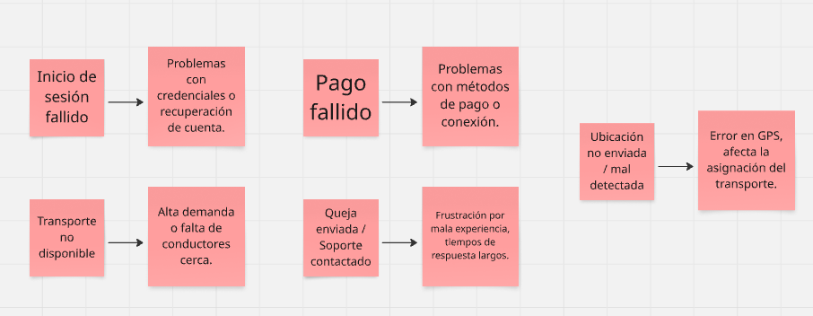

  
  
  
Universidad Peruana de Ciencias Aplicadas  
  
Carrera: Ingeniería de Software  
  
Ciclo: 2024-02  
  
Curso: Aplicaciones Web  
  
Sección: SW52  
  
Profesor: Juan Carlos Tinoco Licas  
  
Informe del Trabajo Final  
  
Startup: TechOps  
  
Producto: ZenFlicks  

| Member                                | Code       |
|---------------------------------------|------------|
| Pilares Pocohuanca, Maria        | u202215528 |
| Ramirez Ortega, Diego Miguel          | u202123548 |

  
**Agosto del 2024**

  
---  
# Registro de Versiones del Informe  
  
| Versión | Fecha       | Autor                                  | Descripción de modificaciones |
|---------|-------------|----------------------------------------|-------------------------------|
| 3.0     | 4/11/2024   | Pilares Pocohuanca, Maria              | Capítulo III                  |
|         |             | Ramirez Ortega, Diego Miguel           |                               |

---  
# Project Report Collaboration Insights  
  

  
---  
# Student Outcome  
El curso contribuye al cumplimiento del Student Outcome ABET: **ABET – EAC - Student Outcome 5**   Criterio: *La capacidad de funcionar efectivamente en un equipo cuyos miembros
juntos proporcionan liderazgo, crean un entorno de colaboración e inclusivo,
establecen objetivos, planifican tareas y cumplen objetivos.*  
  
En el siguiente cuadro se describe las acciones realizadas y enunciados de
conclusiones por parte del grupo, que permiten sustentar el haber alcanzado el logro
del ABET – EAC - Student Outcome 5. 
  
| Criterio específico | Acciones realizadas  | Conclusiones |  
| - | - | - |  
| Trabaja en equipo para proporcionar liderazgo enforma conjunta. |    **Ramirez Ortega, Diego Miguel**   ***TB1:***  - Elaboración de los diagramas C4    - Elaboración de los diagramas de flujo de los Wireframes    **OTRO** ***TB1:***   -  | CONCLUSIONES.  |/*¡¡¡¡¡¡¡¡¡¡AQUÍ EMPIEZA EL OTRO CRITERIOOOOOOOOOOOOOOOOOOOOOOOOOOOO!!!!!!!!!!!*/
| Crea un entorno colaborativo e inclusivo, establece metas,planifica tareas y cumple objetivos. |   **Ramirez Ortega, Diego Miguel**   ***TB1:***  - Elaboración de los diagramas C4    - Elaboración de los diagramas de flujo de los Wireframes    **OTRO** ***TB1:***   -    | CONCLUSIONES. |   
---
# Objetivos SMART
  
---  
# Contenido  
## Tabla de contenidos  
  
### Capítulo I: Introducción
- [1.1. Startup Profile](#11-startup-profile)  
  - [1.1.1 Descripción de la Startup](#111-descripción-de-la-startup)  
  - [1.1.2 Perfiles de integrantes del equipo](#112-perfiles-de-integrantes-del-equipo)  
- [1.2 Solution Profile](#12-solution-profile)  
  - [1.2.1 Antecedentes y problemática](#121-antecedentes-y-problemática)  
  - [1.2.2 Lean UX Process](#122-lean-ux-process)  
      - [1.2.2.1. Lean UX Problem Statements](#1221-lean-ux-problem-statements)  
      - [1.2.2.2. Lean UX Assumptions](#1222-lean-ux-assumptions)  
      - [1.2.2.3. Lean UX Hypothesis Statements](#1223-lean-ux-hypothesis-statements)  
      - [1.2.2.4. Lean UX Canvas](#1224-lean-ux-canvas)  
- [1.3. Segmentos objetivo](#13-segmentos-objetivo)  
  
### Capítulo II: Requirements Elicitation & Analysis 
- [2.1. Competidores](#21-competidores)  
  - [2.1.1. Análisis competitivo](#211-análisis-competitivo)  
  - [2.1.2. Estrategias y tácticas frente a competidores](#212-estrategias-y-táticas-frente-a-competidores)  
- [2.2. Entrevistas](#22-entrevistas)  
  - [2.2.1. Diseño de entrevistas](#221-diseño-de-entrevistas)  
  - [2.2.2. Registro de entrevistas](#222-registro-de-entrevistas)  
  - [2.2.3. Análisis de entrevistas](#223-análisis-de-entrevistas)  
- [2.3. Needfinding](#23-needfinding)  
  - [2.3.1. User Personas](#231-user-personas)  
  - [2.3.2. User Task Matrix](#232-user-task-matrix)  
  - [2.3.3. User Journey Mapping](#233-user-journey-mapping)  
  - [2.3.4. Empathy Mapping](#234-empathy-mapping)  
  - [2.3.5. As-is Scenario Mapping](#235-as-is-scenario-mapping)  
- [2.4. Ubiquitous Language](#24-ubiquitous-language)

  
### Capítulo III: Requirements Specification 
- [3.1. To-Be Scenario Mapping](#31-to-be-scenario-mapping)  
- [3.2. User Stories](#32-user-stories)  
- [3.3. Impact Mapping](#33-impact-mapping)  
- [3.4. Product Backlog](#34-product-backlog)  
  
  
### Capítulo IV: Product Design 
- [4.1. Strategic-Level Domain-Driven Design](#41-Strategic-Level-domain-Driven-design)  
  - [4.1.1. EventStorming](#411-EventStorming) 
    - [4.1.1.1. Candidate Context Discovery](#4111-candidate-context-discovery)
    - [4.1.1.2. Domain Message Flows Modeling](#4112-Domain-Message-Flows-Modeling)
    - [4.1.1.3. Bounded Context Canvases](#4113-Bounded-Context-Canvases)
  - [4.1.2. Context Mapping](#412-Context-Mapping)  
  - [4.1.3. Software Architecture](#413-Software-Architecture)

    - [4.1.3.1. Software Architecture Context Level Diagrams](#4131-Software.Architecture-Context-Level-Diagrams)  
    - [4.1.3.2. Software Architecture Container Level Diagrams](#4132-Software-Architecture-Container-Level-Diagrams)  
    - [4.1.3.3. Software Architecture Deployment Diagrams](#4133-Software-Architecture-Deployment-Diagrams)  
- [4.2. Tactital-Level Domain-Driven Design](#42-Tactital-Level-Domain-Driven-Design)  
  - [4.2.X Bounded Countext: "Bounded Context Name"](#42x-bounded-context-bounded-context-name)
    - [4.2.X.1. Domain Layer](#42x1-domain-layer)
    - [4.2.X.2. Interface Layer](#42x2-interface-layer)
    - [4.2.X.3. Application Layer](#42x3-application-layer)
    - [4.2.X.4. Infrastructure Layer](#42x4-infrastructure-layer)
    - [4.2.X.5. Bounded Context Software Architecture Component Level Diagrams](#42x5-bounded-context-software-architecture-component-level-diagrams)
    - [4.2.X.6. Bounded Context Software Architecture Code Level Diagrams](#42x6-bounded-context-software-architecture-code-level-diagrams)
    - [4.2.X.6.1. Bounded Context Domain Layer CLass Diagram](#42x61-bounded-context-domain-layer-class-diagram)
    - [4.2.X.6.2. Bounded Context Data base Design Diagram](#42x62-bounded-context-data-base-design-diagram)
  
  
---  
# Capítulo I: Introducción  
## 1.1. Startup Profile  

### 1.1.1 Descripción de la Startup  

**Objetivo:** 

**Misión:** . 

### 1.1.2 Perfiles de integrantes del equipo  

<table align="center" border="1" width="70%" style="text-align:center;">
    <tr align="center">
        <td rowspan="3">
            
        </td>
        <td align="left">
            <b>Nombre y Apellido:</b>
             
            Diego Miguel Ramirez Ortega
        </td>
    </tr>
    <tr>
        <td align="left">
            <b>Carrera:</b>
             
            Ingeniería de Software
        </td>
    </tr>
    <tr>
        <td align="left">
            <b>Acerca de:</b>
             
            Mi nombre es Diego Ramirez, tengo 21 años y estoy estudiando la carrera de Ingeniería de Software. Tengo conocimiento en C++, Python y edición de vídeo. Estoy comprometido a completar las tareas que se me asignen a tiempo y apoyar en lo que pueda en el proyecto.
        </td>
    </tr>
</table>
    
 
## 1.2 Solution Profile  

### 1.2.1 Antecedentes y problemática  

### 1.2.2 Lean UX Process  
#### 1.2.2.1. Lean UX Problem Statements  

#### 1.2.2.2. Lean UX Assumptions  

#### 1.2.2.3. Lean UX Hypothesis Statements  

#### 1.2.2.4. Lean UX Canvas  

## 1.3. Segmentos objetivo  

# Capítulo II: Requirements Elicitation & Analysis  
## 2.1 Competidores  

### 2.1.1. Análisis Competitivo  

### 2.1.2. Estrategias y táticas frente a competidores

## 2.2. Entrevistas  

### 2.2.1. Diseño de entrevistas  

### 2.2.2. Registro de entrevistas  

### 2.2.3. Análisis de entrevistas  

## 2.3. Needfinding  

### 2.3.1. User Personas  

### 2.3.2. User Task Matrix  

### 2.3.3. User Journey Mapping  

### 2.3.4. Empathy Mapping  

### 2.3.5. As-is Scenario Mapping  

## 2.4. Ubiquitous Language  

# Capítulo III: Requirements Specification  
## 3.1. To-Be Scenario Mapping  

## 3.2. User Stories  

### 3.2. User Stories

## 3.3. Impact Mapping  

## 3.4. Product Backlog  

# Product Backlog

# Capítulo IV: Product Design  

## 4.1. Strategic-Level Domain-Driven Design

### 4.1.1. EventStorming

Con el objetivo de comprender a profundidad el dominio de la aplicación UniGo, se llevó a cabo una sesión de EventStorming de aproximadamente 2 horas. Esta sesión permitió identificar los eventos clave dentro del sistema, así como actores, comandos, reglas de negocio y problemas potenciales (pain points).
El enfoque se centró en capturar la mayor cantidad de conocimiento del dominio desde una perspectiva colaborativa, permitiendo así una primera aproximación al modelo general del negocio. La herramienta utilizada para la sesión fue Miro, que facilitó la colaboración en tiempo real y la organización visual de los eventos.
La sesión se dividió en las siguientes etapas:
•	Unstructured Exploration (exploración sin estructura)
•	Timelines (flujo del negocio)
•	Pain Points (puntos de fricción)
Se identificaron eventos relacionados con la experiencia del estudiante desde su ingreso a la plataforma hasta la solicitud y ejecución del transporte, incluyendo actividades complementarias como pagos, calificaciones y atención a soporte.

Step 1: Unstructured Exploration

Lluvia de ideas con eventos importantes dentro del dominio de UniGo:

 

 
 Step 2: Timelines 

 Organización de eventos en flujos funcionales y escenarios alternativos.
 
 

 Step 3: Paint Points

 Identificación de puntos conflictivos o dolorosos en la experiencia del usuario:

  

#### 4.1.1.1. Candidate Context Discovery

A partir del EventStorming general, se realizó una segunda sesión enfocada en identificar los Candidate Bounded Contexts

  ##### Authentication:
Gestiona la información y operaciones relacionadas con los datos, cuentas y claves.

  

  ##### Riders:
Gestiona la información y operaciones relacionadas con los pasajeros, incluyendo su verificación y solicitudes.

  

  
  ##### Drivers:
Gestiona la información y operaciones relacionadas con los conductores, incluyendo su registro, verificación, disponibilidad y calificaciones.

  

  ##### Payments:
  Maneja las transacciones financieras, incluyendo pagos de pasajeros y compensaciones a conductores.

  

  ##### Flujo General:
  Representa la interacción y el flujo de información entre los diferentes contextos del sistema.

  

#### 4.1.1.2. Domain Message Flows Modeling

  ##### Security:
Asegura la integridad y confidencialidad de los datos y operaciones del sistema.  

  

  ##### Vehicle (pasajeros):
Proporciona a los pasajeros información sobre los vehículos disponibles, incluyendo tipo, características y estado.

  

  ##### Vehicle (conductores):
Permite a los propietarios de vehículos gestionar la información y disponibilidad de sus autos en el sistema.

  

#### 4.1.1.3. Bounded Context Canvases

  ##### Authentication:
Gestiona la verificación de identidades de usuarios, asegurando que solo usuarios autorizados accedan al sistema.

  

  ##### Carpooling:
Coordina la oferta y demanda de viajes compartidos, emparejando conductores con pasajeros.

  

  ##### Payments:
Maneja todas las operaciones financieras, incluyendo cobros a pasajeros y pagos a conductores.

  

  ##### Notifications:
Envía comunicaciones relevantes a usuarios, como confirmaciones de viajes, pagos y alertas.

  

### 4.1.2. Context Mapping

Context mapping es una técnica utilizada en el desarrollo de software, especialmente en el enfoque Domain-Driven Design (DDD), nos ayuda a visualizar y gestionar las relaciones entre los diferentes Bounded Contexts dentro de un Sistema. En este caso, se mostrará el Context Mapping desarrollado para nuestro sistema:

 

### 4.1.3. Software Architecture

### 4.1.3.1. Software Architecture Context Level Diagrams

### 4.1.3.2. Software Architecture Container Level Diagrams

### 4.1.3.3. Software Architecture Deployment Diagrams

## 4.2. Tactical-Level Domain-Driven Design

### 4.2.1. Bounded Context: Carpooling

<table border="1">
  <thead>
    <tr>
      <th>Clase</th>
      <th>Propósito</th>
      <th>Atributos</th>
      <th>Métodos</th>
    </tr>
  </thead>
  <tbody>
    <tr>
      <td><strong>Viaje</strong></td>
      <td>Representa una cuenta de usuario registrada en el sistema.</td>
      <td>
        <ul>
        <li>id</li>
        <li>origen</li>
        <li>destino</li>
        <li>fecha</li>
        <li>hora</li>
        <li>cupos</li>
        <li>precio</li>
        <li>idConductor</li>
        </ul>
        </td>
      <td>
        <ul>
        <li>agregarPasajero()</li>
        <li>eliminarPasajero()</li>
        <li>cerrarViaje()</li>
        </ul>
        </td>
    </tr>
    <tr>
      <td><strong>Solicitud</strong></td>
      <td>Representa una solicitud de un pasajero para unirse a un viaje.</td>
      <td>
        <ul>
        <li>id</li>
        <li>idViaje</li>
        <li>idPasajero</li>
        <li>estado</li>
        </ul>
        </td>
      <td>
        <ul>
        <li>aceptar()</li>
        <li>rechazar()</li>
        </ul>
        </td>
    </tr>
    <tr>
      <td><strong>Pasajero</strong></td>
      <td>Estudiante que se une al viaje.</td>
      <td>
        <ul>
        <li>id</li>
        <li>nombre</li>
        <li>fotoPerfil</li>
        </ul>
        </td>
      <td>
        </td>
    </tr>
    <tr>
      <td><strong>Conductor</strong></td>
      <td>Estudiante que ofrece su vehículo.</td>
      <td>
        <ul>
        <li>id</li>
        <li>nombre</li>
        <li>vehiculo</li>
        </ul>
        </td>
      <td>
        <ul>
        <li>crearViaje()</li>
        </td>
    </tr>
  </tbody>
</table>

<strong>Relaciones:</strong> 
<ul>
    <li>Un Viaje tiene múltiples Solicitudes.</li>
    <li>Un Conductor puede tener múltiples Viajes.</li>
    <li>Un Pasajero puede enviar muchas Solicitudes.</li>
</ul>

#### 4.2.1.1. Domain Layer

<strong>Entidades</strong> 
<ul>
    <li>Viaje: Representa un viaje publicado por un conductor.</li>
    <li>Solicitud: Representa la solicitud de un estudiante para unirse a un viaje.</li>
</ul>

<strong>Value Objects</strong> 
<ul>
    <li>Ruta: Representa el punto de partida y destino del viaje.</li>
    <li>Horario: Representa el horario de salida y llegada del viaje.</li>
</ul>

<strong>Aggregates</strong> 
<ul>
    <li>Viaje: Contiene a la entidad conductor y la lista de solicitudes de pasajeros.</li>
</ul>

<strong>Domain Services</strong> 
<ul>
    <li>PlanificadorDeViajesService: Lógica de validación de disponibilidad de los viajes para los estudiantes.</li>
</ul>

<strong>Interfaces</strong> 
<ul>
    <li>IViajeRepository: Define los métodos para manejar los viajes.</li>
    <li>ISolicitudRepository: Define los métodos para manejar las solicitudes de viaje.</li>
</ul>

#### 4.2.1.2. Interface Layer

<strong>Controllers</strong> 
<ul>
    <li>ViajeController (publicar viajes, listar, ver detalles)</li>
    <li>SolicitudController (enviar/aceptar/rechazar)</li>
</ul>

<strong>Consumers</strong> 
<ul>
    <li>Procesan eventos recibidos desde otros servicios o sistemas.
</li>
</ul>

#### 4.2.1.3. Application Layer

<strong>Event Handlers</strong> 
<ul>
    <li>PublicarViajeCommandHandler</li>
    <li>SolicitarViajeCommandHandler</li>
    <li>AceptarSolicitudCommandHandler</li>
    <li>SolicitudAceptadaEventHandler</li>
</ul>

#### 4.2.1.4. Infrastructure Layer

<strong>Clases implementadas</strong> 
<ul>
    <li>ViajeRepositorySQL</li>
        - Implementa: IViajeRepository 
        - Responsabilidad: Esta clase se encarga de la gestión de viajes en la base de datos. Implementa los métodos definidos en la interfaz, como guardar un viaje nuevo, buscar un viaje por su ID, y listar viajes activos.
</ul>

<ul>
    <li>SolicitudRepositorySQL</li>
        - Implementa: ISolicitudRepository 
        - Responsabilidad: Se encarga de almacenar y consultar las solicitudes de viaje hechas por los usuarios. Esta clase accede a la base de datos para registrar solicitudes, aceptarlas o rechazarlas.
</ul>

#### 4.2.1.5. Bounded Context Software Architecture Component Level Diagrams

El diagrama muestra los componentes principales de la "Gestión de Viajes Compartidos". La Aplicación Móvil interactúa con los Controladores de Viajes y Solicitudes. Estos controladores utilizan los Servicios correspondientes para la lógica de negocio, los cuales se apoyan en el ValidadorDeReglas. Las flechas indican las interacciones y dependencias entre los componentes.

Para una mejor comprensión, puede visualizar el Architecture Component Level Diagrams. (Ver figura 4.16).

  

<em>Figura 4.16: Component Diagrams de C4 Model nivel 3 - Primer Bounded Context</em>

#### 4.2.1.6. Bounded Context Software Architecture Code Level Diagrams

<strong>Descripción del diagrama:</strong> 
Este diagrama representa la estructura de las clases del Backend API de Usuarios para la gestión de usuarios y autenticación. Las clases y sus relaciones son las siguientes:

Para una mejor comprensión, puede consultar el Architecture Code Level Diagrams. (Ver figura 4.17).

  

<em>Figura 4.17: Primero - Architecture Code Level Diagrams - Primer Bounded Context</em>

 <strong>Descripción del diagrama:</strong> 
Aquí se detalla el comportamiento de la clase SolicitudService, encargada de gestionar el ciclo de vida de una solicitud de viaje: creación, aceptación o rechazo. Se visualiza su relación con la entidad Solicitud y los repositorios involucrados.

Para una mejor comprensión, puede consultar el Architecture Code Level Diagrams. (Ver figura 4.18).

  

<em>Figura 4.18: Segundo - Architecture Code Level Diagrams - Primer Bounded Context</em>

**Enlace de los Architecture Code Level Diagrams:** [Ver en lucidChart](https://lucid.app/lucidchart/ba7eb10c-e544-4fc8-b804-4b6c61c27512/edit?viewport_loc=-545%2C652%2C4185%2C1849%2C0_0&invitationId=inv_486fb944-f084-487f-9a62-6dd27fdd0cd6)

##### 4.2.1.6.1 Bounded Context Domain Layer Class Diagrams

<strong>Descripción:</strong> 
Este diagrama representa las clases del Domain Layer del Bounded Context “Gestión de Viajes Compartidos”. Se incluyen las entidades principales como Viaje, Solicitud, Conductor y Pasajero, así como objetos de valor Ruta y Horario, el servicio de dominio PlanificadorDeViajesService, la enumeración EstadoSolicitud y las interfaces de repositorio.

Para mayor información, visualizar la (ver figura 4.19).

  

<em>Figura 4.19: Domain Layer Class Diagrams - Primer Bounded Context</em>

**Enlace del Domain Layer Class Diagrams:** [Ver en lucidChart](https://lucid.app/lucidchart/1d047c21-2027-4f55-826b-3d8aa0187af3/edit?viewport_loc=-1190%2C-145%2C4389%2C1939%2C0_0&invitationId=inv_234c091b-78e7-4740-a8f4-c143c10b6b47)

##### 4.2.1.6.2 Bounded Context Database Design Diagram

El diagrama de base de datos representa los objetos relacionales necesarios para almacenar la información persistente del bounded context Gestión de Viajes Compartidos. Se definen cuatro tablas principales: Conductores, Viajes, Pasajeros y Solicitudes.
Las relaciones reflejan el dominio: un conductor puede crear múltiples viajes (1:N), un pasajero puede realizar múltiples solicitudes (1:N), y un viaje puede recibir múltiples solicitudes (1:N).
Se especifican claves primarias (PK) para cada tabla, claves foráneas (FK) que representan las relaciones, y constraints como CHECK en la columna estado para validar valores válidos en la tabla Solicitudes.

Para mayor información, visualizar la (ver figura 4.20).

  

<em>Figura 4.20: Database Design Diagram - Primer Bounded Context</em>

### 4.2.2. Bounded Context: Authentication

<table border="1">
  <thead>
    <tr>
      <th>Clase</th>
      <th>Propósito</th>
      <th>Atributos</th>
      <th>Métodos</th>
    </tr>
  </thead>
  <tbody>
    <tr>
      <td><strong>Usuario</strong></td>
      <td>Representa una cuenta de usuario registrada en el sistema.</td>
      <td>
        <ul>
        <li>id</li>
        <li>nombre</li>
        <li>correo</li>
        <li>contraseña</li>
        <li>rol_id</li>
        <li>perfil_id</li>
        </ul>
        </td>
      <td>
        <ul>
        <li>registrar()</li>
        <li>desactivar()</li>
        <li>autenticar()</li>
        </ul>
        </td>
    </tr>
    <tr>
      <td><strong>Perfil</strong></td>
      <td>Representa la información pública y personal del usuario.</td>
      <td>
        <ul>
        <li>id</li>
        <li>usuarioId</li>
        <li>codigoUniversitario</li>
        <li>fotoPerfil</li>
        <li>carnetUniversitario</li>
        <li>teléfono</li>
        <li>direccion</li>
        </ul>
        </td>
      <td>
        <ul>
        <li>actualizarPerfil()</li>
        </ul>
        </td>
    </tr>
    <tr>
      <td><strong>Token</strong></td>
      <td>Controla los Códigos de verificación de cuenta o recuperación.</td>
      <td>
        <ul>
        <li>id</li>
        <li>usuarioId</li>
        <li>valor</li>
        <li>fechaExpiración</li>
        </ul>
        </td>
      <td>
        <ul>
        <li>generarCodigo()</li>
        <li>validarCodigo()</li>
        </td>
    </tr>
    <tr>
      <td><strong>Rol</strong></td>
      <td>Define los permisos y accesos asignados a cada tipo de usuario</td>
      <td>
        <ul>
        <li>id</li>
        <li>tipoUsuario</li>
        <li>permisos</li>
        </ul>
        </td>
      <td>
        <ul>
        <li>asignarUsuario()</li>
        <li>asignarPermiso()</li>
        </td>
    </tr>
  </tbody>
</table>

<strong>Relaciones:</strong> 
<ul>
    <li>Un Usuario tiene un solo Perfil</li>
    <li>Un Usuario tiene un solo Perfil</li>
    <li>Un Usuario puede tener múltiples códigos de token simultáneamente</li>
</ul>

#### 4.2.2.1. Domain Layer

<strong>Entidades</strong> 
<ul>
    <li>Usuario: Representa la cuenta de una persona registrada.</li>
    <li>Perfil: Almacena detalles personales o visibles del usuario.</li>
    <li>Token: Almacena y valida los códigos enviados para verificar identidad.</li>
    <li>Rol: Administra los roles y permisos que puede tener un usuario.</li>
</ul>

<strong>Value Objects</strong> 
<ul>
    <li>Correo: Garantiza que un correo tiene un formato válido.</li>
    <li>Contrasena: Encapsula la lógica de hashing y validación de contraseñas.</li>
</ul>

<strong>Aggregates</strong> 
<ul>
    <li>Usuario: Agregado raíz que controla la creación, autenticación y estado del usuario.</li>
</ul>

<strong>Domain Services</strong> 
<ul>
    <li>AutenticadorService: Realiza la validación de credenciales y emite tokens de sesión.</li>
    <li>GestorDeRolesService: Administra la asignación y verificación de roles de usuario.</li>
</ul>

<strong>Interfaces</strong> 
<ul>
    <li>IUsuarioRepository: Define métodos para almacenar y recuperar usuarios.</li>
    <li>IRolRepository: Define métodos para manejar roles.</li>
    <li>ITokenRepository: Define métodos para manejar verificaciones de seguridad.</li>
</ul>

#### 4.2.2.2. Interface Layer

<strong>Controllers</strong> 
<ul>
    <li>UsuarioController (registrar, autenticar, actualizar perfil).</li>
    <li>TokenController (enviar código de verificación, validar código).</li>
    <li>RolController (asignar roles, listar roles).</li>
</ul>

<strong>Consumers</strong> 
<ul>
    <li>Escucha eventos de verificación de correo o confirmaciones externas de sistemas de seguridad.</li>
</ul>

#### 4.2.2.3. Application Layer

<strong>Command Handlers</strong> 
<ul>
    <li>RegistrarUsuarioCommandHandler: Maneja el registro de nuevos usuarios.</li>
    <li>AutenticarUsuarioCommandHandler: Gestiona la autenticación de credenciales.</li>
    <li>ActualizarPerfilCommandHandler: Actualiza la información de perfil.</li>
    <li>AsignarRolCommandHandler: Asigna un rol a un usuario.</li>
</ul>

<strong>Event Handlers</strong> 
<ul>
    <li>UsuarioRegistradoEventHandler: Envía correo de bienvenida o de verificación.</li>
    <li>TokenExitosaEventHandler: Activa la cuenta del usuario.</li>
</ul>

#### 4.2.2.4. Infrastructure Layer

<strong>Clases implementadas</strong> 
<ul>
    <li>UsuarioRepositorySQL</li>
        - Implementa: IUsuarioRepository 
        - Responsabilidad: Guardar, consultar, actualizar usuarios en la base de datos.
</ul>

<ul>
    <li>TokenRepositorySQL</li>
        - Implementa: IUsuarioRepository 
        - Responsabilidad: Almacena códigos de verificación y controla su expiración.
</ul>

<ul>
    <li>RolRepositorySQL</li>
        - Implementa: IRolRepository 
        - Responsabilidad: Gestiona roles y permisos en la base de datos.
</ul>

#### 4.2.2.5. Bounded Context Software Architecture Component Level Diagrams

El container Backend API de Usuarios expone y gestiona los servicios relacionados con la autenticación, registro y asignación de roles para los usuarios que interactúan con la plataforma. Este container está diseñado siguiendo principios de separación de responsabilidades, facilitando mantenimiento, escalabilidad y pruebas.
A continuación, se describen sus componentes: 

<ul>
    <li>UsuarioController</li>
    Este componente actúa como la capa de entrada al sistema. Expone endpoints REST que permiten a los usuarios registrarse, iniciar sesión y consultar o actualizar sus datos personales.
     Implementación: Framework REST (Spring Boot Controller, Express.js Router o ASP.NET Controller).
</ul>

<ul>
    <li>AutenticacionService</li>
    Este servicio encapsula la lógica relacionada con la autenticación de usuarios, incluyendo la validación de credenciales, la generación de tokens y la verificación de identidades en cada solicitud.
</ul>

<ul>
    <li>UsuarioService</li>
    Es el componente encargado de gestionar la lógica de negocio vinculada a la creación, modificación y eliminación de usuarios en el sistema. Además, coordina la asignación de roles y la validación de reglas antes de persistir los datos.
</ul>

<ul>
    <li>RolService</li>
    Responsable de administrar la asignación de roles y sus respectivos permisos a los usuarios. Permite definir los accesos que cada tipo de usuario posee en el sistema, facilitando la seguridad y el control de privilegios.
</ul>

<ul>
    <li>UsuarioRepository</li>
    Este componente tiene como responsabilidad la persistencia y recuperación de datos de usuarios en la base de datos. Es utilizado por UsuarioService para realizar operaciones CRUD.
</ul>

<ul>
    <li>RolRepository</li>
    Permite realizar operaciones de lectura y escritura sobre la entidad de roles. Provee los datos necesarios para RolService cuando se requiere consultar o modificar la configuración de permisos.
</ul>

Para una mejor comprensión, puede consultar el  Component Diagrams de C4 Model nivel 3. (Ver figura 4.21).

  

<em>Figura 4.21: Component Diagrams de C4 Model nivel 3 - Segundo Bounded Context</em>

#### 4.2.2.6. Bounded Context Software Architecture Code Level Diagrams

<strong>Descripción del diagrama:</strong> 
Este diagrama representa la estructura de las clases del Backend API de Usuarios para la gestión de usuarios y autenticación. Las clases y sus relaciones son las siguientes:

<ul>
    <li>UsuarioController:</li>
    Actúa como el controlador que maneja las solicitudes de los usuarios. Ofrece métodos para registrar usuarios (registrarUsuario), realizar el login (login), y actualizar el perfil (actualizarPerfil). Estos métodos se apoyan en los servicios de negocio para manejar la lógica.
</ul>

<ul>
    <li>UsuarioService:</li>
    Es el servicio responsable de gestionar la lógica de negocio relacionada con los usuarios. Implementa funcionalidades como crear un usuario (crearUsuario), validar las credenciales del usuario (validarCredenciales), y actualizar el perfil (actualizarPerfil).
</ul>

<ul>
    <li>AutenticacionService:</li>
    Se encarga de la autenticación de los usuarios. Ofrece dos métodos: generar un token (generarToken), que se utiliza para autenticar a los usuarios, y validar un token (validarToken), que verifica si el token proporcionado es válido.
</ul>

Para una mejor comprensión, puede consultar el Architecture Code Level Diagrams. (Ver figura 4.22).

  

<em>Figura 4.22: Primero - Architecture Code Level Diagrams - Segundo Bounded Context</em>

 <strong>Descripción del diagrama:</strong> 
AutenticacionService es la clase principal que maneja la lógica de autenticación. Tiene métodos como generarToken y validarToken.

<ul>
    <li>UsuarioRepository:</li>
    Es la clase responsable de acceder a los datos del usuario, como buscar el usuario por correo electrónico (findByEmail).
</ul>

<ul>
    <li>TokenProvider:</li>
    Es la clase encargada de crear y validar el token
</ul>

<ul>
    <li>CryptPasswordEncoder:</li>
    Es utilizado para comparar las contraseñas proporcionadas con las almacenadas de manera segura.
</ul>

Para una mejor comprensión, puede consultar el Architecture Code Level Diagrams. (Ver figura 4.23).

  

<em>Figura 4.23: Segundo - Architecture Code Level Diagrams - Segundo Bounded Context</em>

**Enlace de los Architecture Code Level Diagrams:** [Ver en lucidChart](https://lucid.app/lucidchart/4b8b9ee9-db64-48be-b774-0578fc824a01/edit?viewport_loc=-1344%2C-1816%2C3104%2C1371%2C0_0&invitationId=inv_e8e4be50-05d4-450a-b220-406c189108ab)

##### 4.2.2.6.1 Bounded Context Domain Layer Class Diagrams

<strong>Descripción:</strong> 
Este diagrama representa las clases principales del dominio dentro del contexto del módulo de gestión de identidad. Incluye la entidad Usuario, que encapsula comportamientos como el registro y la autenticación. El Usuario está asociado con un Perfil, donde se almacenan datos complementarios como el código universitario y el número de teléfono. Cada Usuario posee un Rol que define sus permisos dentro del sistema. Además, el diagrama contempla el uso de tokens de autenticación (Token) y objetos de valor como Correo y Contrasena, los cuales encapsulan reglas específicas de validación y seguridad.
Para mayor información, visualizar la (ver figura 4.24).

  

<em>Figura 4.24: Domain Layer Class Diagrams - Segundo Bounded Context</em>

**Enlace del Domain Layer Class Diagrams:** [Ver en lucidChart](https://lucid.app/lucidchart/d3478451-d855-4364-8380-db7c3b9a8999/edit?view_items=EA-.6kuKofyw%2CvB-.9Cp3lQPH%2CkC-.sSRl1unG%2CFd_.7oFA~jvM%2Cee_.ufJKZoYj%2CCx-.ABiQpxiO%2C1f_.qd4BxEP0%2Cvg_.OG0LlEVb%2CYg_.IM_P0UbJ%2CDf_.iayTwdFz%2Ceh_.znL86IT7%2Cdg_.jh9tgYmg%2CLg_.kUps2Vfb%2C-g_.lyED5O4d&invitationId=inv_d3ac8bfe-466b-405b-9556-2ad17c5aaa7b)

##### 4.2.2.6.2 Bounded Context Database Design Diagram

El diseño de base de datos representa la estructura relacional del sistema de gestión de usuarios. La tabla Usuario almacena los datos principales como nombre, correo, contraseña y fecha de creación, y se vincula mediante claves foráneas a un Perfil y un Rol. El Perfil contiene información personal adicional como el código universitario, teléfono, dirección y biografía del usuario. El Rol define los tipos de usuario y sus permisos. Por último, la tabla Token almacena los tokens de autenticación generados por cada usuario para manejar sesiones y accesos. Las relaciones entre tablas reflejan una estructura lógica y segura para garantizar una gestión adecuada de la autenticación y los permisos.
Para mayor información, visualizar la (ver figura 4.25).

  

<em>Figura 4.25: Database Design Diagram - Segundo Bounded Context</em>

# Conclusiones
Para asegurar el éxito en el desarrollo del proyecto, es fundamental que todos los integrantes del equipo participen activamente y colaboren de manera equitativa, permitiendo así un avance eficiente hacia los objetivos del trabajo como del curso. La correcta elaboración de User Stories , del Product Backlog junto con las entrevistas nos permitirá comprender con claridad qué características y funcionalidades debe incluir la app para ser realmente útil y práctica para los usuarios.

Por último, la definición adecuada de los Bounded Contexts que se emplearán en la aplicación contribuirá a una mejor organización del sistema, facilitando su desarrollo, mantenimiento y escalabilidad.

# Bibliografías

- C4 Model. (s.f.). *Container diagram*. [https://c4model.com/diagrams/container](https://c4model.com/diagrams/container)

- Comunica. (2024, diciembre 5). *Estudiantes universitarios sufren la falta de transporte estudiantil*. [https://comunica.edu.sv/2024/12/05/estudiantes-universitarios-sufren-la-falta-de-transporte-estudiantil](https://comunica.edu.sv/2024/12/05/estudiantes-universitarios-sufren-la-falta-de-transporte-estudiantil)

# Anexos

- As-Is Scenario Mapping : 
[https://miro.com/app/board/uXjVKlGuWKk=/](https://miro.com/app/board/uXjVKlGuWKk=/)

- Bounded Context Software Architecture Code Level Diagrams - 1:  
[https://lucid.app/lucidchart/ba7eb10c-e544-4fc8-b804-4b6c61c27512/edit?invitationId=inv_486fb944-f084-487f-9a62-6dd27fdd0cd6&page=0_0#](https://lucid.app/lucidchart/ba7eb10c-e544-4fc8-b804-4b6c61c27512/edit?invitationId=inv_486fb944-f084-487f-9a62-6dd27fdd0cd6&page=0_0#)

- Bounded Context Domain Layer Class Diagrams - 1:  
[https://lucid.app/lucidchart/1d047c21-2027-4f55-826b-3d8aa0187af3/edit?invitationId=inv_234c091b-78e7-4740-a8f4-c143c10b6b47&page=0_0#](https://lucid.app/lucidchart/1d047c21-2027-4f55-826b-3d8aa0187af3/edit?invitationId=inv_234c091b-78e7-4740-a8f4-c143c10b6b47&page=0_0#)

- Bounded Context Software Architecture Code Level Diagrams - 2:  
[https://lucid.app/lucidchart/4b8b9ee9-db64-48be-b774-0578fc824a01/edit?invitationId=inv_e8e4be50-05d4-450a-b220-406c189108ab&page=0_0#](https://lucid.app/lucidchart/4b8b9ee9-db64-48be-b774-0578fc824a01/edit?invitationId=inv_e8e4be50-05d4-450a-b220-406c189108ab&page=0_0#)

- Bounded Context Domain Layer Class Diagrams - 2:  
[https://lucid.app/lucidchart/d3478451-d855-4364-8380-db7c3b9a8999/edit?invitationId=inv_d3ac8bfe-466b-405b-9556-2ad17c5aaa7b&page=0_0#](https://lucid.app/lucidchart/d3478451-d855-4364-8380-db7c3b9a8999/edit?invitationId=inv_d3ac8bfe-466b-405b-9556-2ad17c5aaa7b&page=0_0#)

